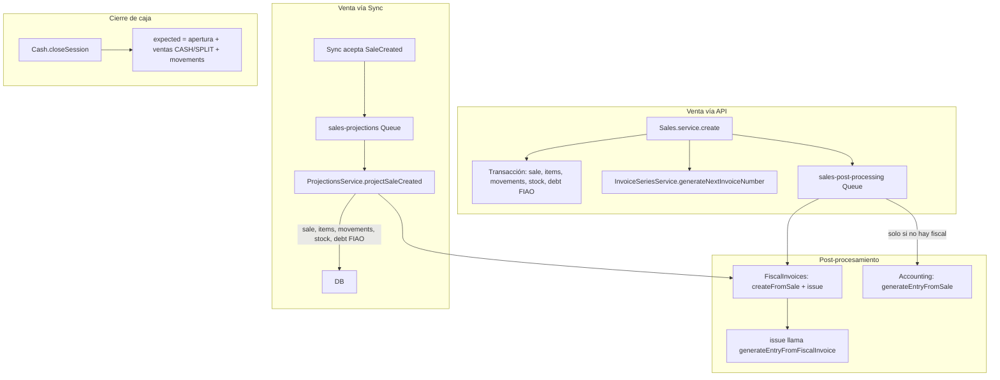

# Plan de verificación y depuración de los flujos core del POS

## Resumen de arquitectura actual

---

## 1. Prerrequisitos y Setup

**Objetivo:** Asegurar que la tienda tiene todo lo necesario para que una venta replique datos correctamente.

**Archivos:** [apps/api/src/setup/setup.service.ts](apps/api/src/setup/setup.service.ts), [apps/api/src/accounting/chart-of-accounts.service.ts](apps/api/src/accounting/chart-of-accounts.service.ts) (initializeDefaultChartOfAccounts), [apps/api/src/accounting/templates/chart-templates.ts](apps/api/src/accounting/templates/chart-templates.ts) (getDefaultMappings).

**Checklist de verificación:**

- **Warehouse:** al menos uno, con uno por defecto (`getDefaultOrFirst`). Sin esto, la venta falla.
- **Invoice series:** al menos una activa. Sin esto, la venta se crea pero `invoice_number` / `invoice_full_number` quedan null ([sales.service.ts líneas 1550-1557](apps/api/src/sales/sales.service.ts)).
- **Fiscal config:** una activa si se quieren facturas fiscales. `createFromSale` lanza si no existe ([fiscal-invoices.service.ts 139-146](apps/api/src/fiscal-invoices/fiscal-invoices.service.ts)).
- **PaymentMethodConfig:** por método (CASH_BS, CASH_USD, PAGO_MOVIL, etc.). Si no hay registro, `PaymentRulesService.validatePaymentMethod` permite; si existe y `enabled=false`, rechaza.
- **Contabilidad:** `chart_of_accounts` + `accounting_account_mappings` con al menos `sale_revenue`, `sale_cost`; para asientos de venta también `cash_asset`, `accounts_receivable`, `inventory_asset`. Sin `revenue` o `cost`, `generateEntryFromSale` retorna null ([accounting.service.ts 294-296](apps/api/src/accounting/accounting.service.ts)).

**Pasos de depuración:**

1. Endpoint o script que ejecute `SetupService.setupStore` y devuelva `steps_completed` / `steps_failed`.
2. Consultas para comprobar: `invoice_series` (is_active), `fiscal_config` (is_active), `payment_method_config`, `chart_of_accounts`, `accounting_account_mapping` (transaction_type en sale_revenue, sale_cost, cash_asset, accounts_receivable, inventory_asset).
3. Caso: store sin setup completo; crear venta y ver qué falla o qué se omite (invoice null, sin fiscal, sin asiento).

---

## 2. Métodos de pago habilitados

**Objetivo:** Que las validaciones de pago rechacen métodos deshabilitados y cumplan topes.

**Archivos:** [apps/api/src/payments/payment-rules.service.ts](apps/api/src/payments/payment-rules.service.ts), [apps/api/src/sales/sales.service.ts](apps/api/src/sales/sales.service.ts) (aprox. 1496-1542: `validatePaymentMethod`, `validateSplitPayment`, `validatePaymentAuthorization`).

**Checklist:**

- `PaymentMethodConfig.enabled = false` para un método: venta con ese método debe ser rechazada con mensaje claro.
- `min_amount_bs/usd` y `max_amount_bs/usd`: montos por debajo/encima deben rechazarse.
- SPLIT: `validateSplitPayment` valida cada parte (cash_bs, cash_usd, pago_movil_bs, etc.) con las mismas reglas.
- `requires_authorization`: `validatePaymentAuthorization` (y posible guard de rol) debe exigir autorización cuando aplique.

**Pasos de depuración:**

1. Configurar un método (ej. PAGO_MOVIL) con `enabled=false`; intentar venta CASH_BS (OK) y PAGO_MOVIL (rechazo).
2. Fijar `max_amount_bs` bajo; venta que supere debe fallar.
3. SPLIT con una parte que supere tope: debe fallar.
4. Revisar que `CreateSaleDto` y el flujo pasen siempre por `validatePaymentMethod` / `validateSplitPayment` antes de la transacción.

---

## 3. Serie de factura

**Objetivo:** Que cada venta (API) tenga `invoice_series_id`, `invoice_number`, `invoice_full_number` cuando existe serie activa.

**Archivos:** [apps/api/src/invoice-series/invoice-series.service.ts](apps/api/src/invoice-series/invoice-series.service.ts) (`generateNextInvoiceNumber`), [apps/api/src/sales/sales.service.ts](apps/api/src/sales/sales.service.ts) (1533-1597: genera número y asigna a la sale).

**Checklist:**

- Con serie activa: la venta tiene `invoice_series_id`, `invoice_number`, `invoice_full_number` coherentes con el formato (prefix, series_code, número).
- `dto.invoice_series_id` opcional: si se envía, se usa esa serie; si no, se usa la primera activa por `created_at`.
- Sin series activas: la venta se crea con `invoice_*` en null; no debe fallar (solo warn en logs).
- Atomicidad: `generateNextInvoiceNumber` usa `UPDATE ... RETURNING`; no debe haber duplicados ni huecos raros en concurrencia.

**Pasos de depuración:**

1. Crear 2–3 ventas seguidas y comprobar que `invoice_number` es creciente y que `invoice_series.current_number` coincide.
2. Dos series activas: enviar `invoice_series_id` en el DTO y verificar que se usa la indicada.
3. Desactivar todas las series: venta OK con `invoice_*` null.
4. **Sync:** en `projectSaleCreated` la sale se crea **sin** `invoice_series_id`, `invoice_number`, `invoice_full_number`. La factura fiscal en `createFromSale` genera su propio número y no actualiza la sale. Ver sección 10.

---

## 4. Venta con pago al contado (CASH_BS / CASH_USD)

**Objetivo:** Venta contado crea sale, items, movimientos de inventario, actualiza stock, y queda lista para fiscal/contable y caja.

**Archivos:** [apps/api/src/sales/sales.service.ts](apps/api/src/sales/sales.service.ts) (create completo), [apps/api/src/cash/cash.service.ts](apps/api/src/cash/cash.service.ts) (closeSession, 177-251).

**Checklist:**

- **Sesión de caja:** sin sesión abierta (o `cash_session_id` distinto a la abierta) la venta debe fallar.
- **Sale:** `cash_session_id`, `totals`, `payment.method`, `payment.cash_payment` o `payment.cash_payment_bs` según corresponda.
- **Inventario:** `inventory_movements` (sold, qty_delta negativo), `warehouse_stock` actualizado. Con lotes, salida FIFO y `sale_item.lot_id` asignado.
- **Caja:** en `closeSession`, `expected` incluye CASH_BS (received_bs - change_bs) y CASH_USD (received_usd; change_bs se descuenta de Bs). Probar con `cash_payment` y `cash_payment_bs` bien enviados.

**Pasos de depuración:**

1. Abrir caja, crear venta CASH_BS con `cash_payment_bs: { received_bs, change_bs }`; verificar sale, movements, stock.
2. Cerrar caja: `expected` Bs = apertura + (received_bs - change_bs). Comprobar que `counted` vs `expected` se valida correctamente.
3. CASH_USD con cambio en Bs: `cash_payment: { received_usd, change_bs }`; expected USD += received_usd, expected Bs -= change_bs.
4. Revisar que no se crean `sale_payments` ni `cash_movements` en este flujo (sale.payment en JSONB es la fuente; `cash_movements` es para entradas/salidas manuales).

---

## 5. Venta FIAO (fiado)

**Objetivo:** FIAO exige cliente con crédito, crea deuda, no suma a efectivo en caja y contable usa cuentas por cobrar.

**Archivos:** [apps/api/src/sales/sales.service.ts](apps/api/src/sales/sales.service.ts) (1718-1784: validación crédito y creación de debt), [apps/api/src/projections/projections.service.ts](apps/api/src/projections/projections.service.ts) (419-477: debt en proyección), [apps/api/src/accounting/accounting.service.ts](apps/api/src/accounting/accounting.service.ts) (331-343: FIAO → accounts_receivable), [apps/api/src/cash/cash.service.ts](apps/api/src/cash/cash.service.ts) (251: FIAO no suma a expected).

**Checklist:**

- **Cliente:** FIAO requiere `customer_id` o datos para crear/identificar cliente (`customer_name` + `customer_document_id` o `customer_id`). Si no, BadRequest.
- **Crédito:** `customer.credit_limit` > 0 y (credit_limit - deuda abierta) >= total_usd. Se valida antes de la TX (aproximado) y dentro de la TX (total real).
- **Debt:** en la misma TX que la sale se crea `Debt` (sale_id, customer_id, amount_bs, amount_usd, status OPEN). En proyección, igual.
- **Caja:** FIAO no suma a `expected` (comentario explícito en cash.service).
- **Contable:** `generateEntryFromSale` con `payment.method === 'FIAO'` usa `accounts_receivable` en lugar de `cash_asset`.

**Pasos de depuración:**

1. Cliente con `credit_limit = 100`; deuda abierta 60. Venta FIAO 50 USD: OK. Venta 45 USD: debe fallar por crédito insuficiente.
2. Verificar en BD: `debts` con `sale_id` y `customer_id` correctos.
3. Cerrar caja con ventas FIAO y contado: `expected` solo debe incluir las de contado.
4. Asiento contable: debe existir línea de débito a cuentas por cobrar (y no a caja) para la venta FIAO.

---

## 6. Venta SPLIT

**Objetivo:** SPLIT con `split` o `split_payments` validado y reflejado en sale y en cierre de caja.

**Archivos:** [apps/api/src/sales/sales.service.ts](apps/api/src/sales/sales.service.ts) (validación SPLIT, armado de `payment.split` / `payment.split_payments`), [apps/api/src/sales/dto/create-sale.dto.ts](apps/api/src/sales/dto/create-sale.dto.ts), [apps/api/src/cash/cash.service.ts](apps/api/src/cash/cash.service.ts) (240-249: solo `payment.split`).

**Checklist:**

- `payment.method === 'SPLIT'` exige `split` o `split_payments` que sumen el total; si no, BadRequest.
- `validateSplitPayment` valida cada componente (cash_bs, cash_usd, pago_movil_bs, transfer_bs, other_bs) con `PaymentRulesService`.
- La sale guarda `payment.split` y/o `payment.split_payments`.
- **Caja:** `closeSession` solo considera `payment.split.cash_bs` y `payment.split.cash_usd`. `payment.split_payments` (array) **no** se usa para `expected`. Si en el futuro se usa `split_payments` como fuente de verdad para efectivo, habría que alinear.

**Pasos de depuración:**

1. SPLIT con `split: { cash_bs: X, pago_movil_bs: Y }` donde X+Y = total_bs; venta OK. Verificar `payment.split` en la sale.
2. Cerrar caja: `expected` Bs debe sumar solo `payment.split.cash_bs` (pago_movil no suma a efectivo).
3. SPLIT con `split_payments` y sin `split`, o con `split` que no cuadre con el total: debe fallar en validación.
4. Documentar o corregir: si `split_payments` puede ser la única fuente para SPLIT, decidir si caja debe leer de ahí y mantener coherencia.

---

## 7. Configuración fiscal y factura fiscal

**Objetivo:** Con fiscal config activa, la venta (API o Sync) debe terminar con factura fiscal emitida y, vía `issue()`, con asiento contable.

**Archivos:** [apps/api/src/fiscal-invoices/fiscal-invoices.service.ts](apps/api/src/fiscal-invoices/fiscal-invoices.service.ts) (createFromSale, issue, hasActiveFiscalConfig), [apps/api/src/sales/queues/sales-post-processing.queue.ts](apps/api/src/sales/queues/sales-post-processing.queue.ts), [apps/api/src/projections/projections.service.ts](apps/api/src/projections/projections.service.ts) (479-558).

**Checklist:**

- **API:** post-processing: si `hasActiveFiscalConfig`, `createFromSale` + `issue`. Si ya existe factura en draft, solo `issue`. `issue()` llama `accountingService.generateEntryFromFiscalInvoice` ([fiscal-invoices.service.ts 514](apps/api/src/fiscal-invoices/fiscal-invoices.service.ts)).
- **Sync:** en `projectSaleCreated`, si `hasActiveFiscalConfig` y no existe factura: `createFromSale` + `issue`. Misma lógica contable.
- **createFromSale:** requiere `FiscalConfig` activa; usa `sale.invoice_series_id` (puede ser null en sync). Si null, `generateInvoiceNumber` usa la serie por defecto. La factura fiscal tiene su `invoice_number`; la sale **no** se actualiza con él. Para Sync, la sale queda con `invoice_*` null y la fiscal con número; es aceptable si los reportes usan `fiscal_invoice.invoice_number` cuando exista.
- **Sin fiscal config:** no se crea factura; en post-processing se cae al branch de `generateEntryFromSale` (solo cuando `!fiscalInvoiceFound`).

**Pasos de depuración:**

1. Con fiscal config activa: crear venta por API; esperar a que termine el job de post-processing. Comprobar `fiscal_invoices` (sale_id, status issued) y `journal_entries` (source_type/ source_id vinculados a fiscal o a sale según implementación de `generateEntryFromFiscalInvoice`).
2. Sin fiscal config: venta por API; no debe haber fila en `fiscal_invoices`; debe haber asiento por `generateEntryFromSale` (si hay mappings).
3. **Redundancia fiscal:** API no encola proyección; Sync no encola post-processing. No hay doble factura para la misma venta. Idempotencia: `createFromSale` lanza si ya existe factura para esa sale.

---

## 8. Configuración contable y asientos

**Objetivo:** Toda venta que deba llevar contabilidad debe generar un asiento (por venta o por factura fiscal), con mapeos correctos.

**Archivos:** [apps/api/src/accounting/accounting.service.ts](apps/api/src/accounting/accounting.service.ts) (generateEntryFromSale, generateEntryFromFiscalInvoice), [apps/api/src/sales/queues/sales-post-processing.queue.ts](apps/api/src/sales/queues/sales-post-processing.queue.ts) (112-138), [apps/api/src/fiscal-invoices/fiscal-invoices.service.ts](apps/api/src/fiscal-invoices/fiscal-invoices.service.ts) (issue).

**Checklist:**

- **Con factura fiscal emitida:** `generateEntryFromSale` retorna null si existe `fiscal_invoices` issued para esa sale ([accounting.service.ts 273-279](apps/api/src/accounting/accounting.service.ts)). El asiento se genera en `generateEntryFromFiscalInvoice` desde `issue()`.
- **Sin factura fiscal:** post-processing ejecuta `generateEntryFromSale` solo cuando `!fiscalInvoiceIssued && !fiscalInvoiceFound`. Necesita mappings: `sale_revenue`, `sale_cost`; para débitos: `cash_asset` (contado) o `accounts_receivable` (FIAO); si hay costo, `inventory_asset`.
- **FIAO:** débito a `accounts_receivable`; ingreso a `sale_revenue`; si hay costo: `sale_cost` e `inventory_asset`.
- **Conteo de costo:** `calculateSaleCosts` desde `sale_items` (incl. lotes); `updateAccountBalances` después de guardar asiento y líneas.

**Pasos de depuración:**

1. Con contabilidad inicializada (Setup): venta contado con costo > 0. Verificar `journal_entries` (source_type 'sale', source_id = sale.id o según fiscal), `journal_entry_lines` (cuadre débito/crédito) y `account_balances`.
2. Venta FIAO: asiento con cuenta por cobrar, sin caja.
3. **Gap:** venta por **Sync sin fiscal config** nunca pasa por post-processing y `projectSaleCreated` no llama `generateEntryFromSale`. Esas ventas quedan sin asiento. Ver sección 10.

---

## 9. Integración con caja (expected, movimientos, cierre)

**Objetivo:** El cierre de caja calcule `expected` correctamente a partir de ventas y movimientos manuales, y FIAO no cuente como efectivo.

**Archivos:** [apps/api/src/cash/cash.service.ts](apps/api/src/cash/cash.service.ts) (closeSession, 144-268; getMovementTotals), [apps/api/src/payments/cash-movements.service.ts](apps/api/src/payments/cash-movements.service.ts).

**Checklist:**

- **Expected:** apertura (opening_amount_bs, opening_amount_usd) + suma de ventas de la sesión (solo CASH_BS, CASH_USD, SPLIT vía `payment.split.cash_bs`/`cash_usd`) + `getMovementTotals` (cash_movements de la sesión: entry suma, exit resta). FIAO, PAGO_MOVIL, TRANSFER, OTHER no suman.
- **CASH_BS:** si `payment.cash_payment_bs`: +received_bs, -change_bs. Si no, +total_bs.
- **CASH_USD:** si `payment.cash_payment`: +received_usd, -change_bs (en Bs). Si no, +total_usd.
- **SPLIT:** solo `payment.split.cash_bs` y `payment.split.cash_usd`.
- **Doble cálculo:** `expectedBs` vs `expectedBsVerify` (y USD) deben coincidir; si no, se lanza.

**Pasos de depuración:**

1. Sesión con 2 CASH_BS y 1 FIAO: `expected` solo de las 2 CASH_BS.
2. CASH_BS con `received_bs` > total y `change_bs` > 0: expected Bs = apertura + received_bs - change_bs.
3. Añadir `cash_movements` (entry/exit) a la sesión; comprobar que `getMovementTotals` y el `expected` final son correctos.
4. Cerrar con `counted` distinto a `expected`: debe fallar la validación de cierre (o mostrarse diferencia según reglas de negocio).

---

## 10. Sync (SaleCreated) y proyección

**Objetivo:** Ventas llegadas por Sync con evento SaleCreated deben replicar sale, inventario, deuda (FIAO), fiscal (si hay config) y contable; y alinear invoice cuando corresponda.

**Archivos:** [apps/api/src/sync/sync.service.ts](apps/api/src/sync/sync.service.ts) (push, validaciones, encolado a sales-projections), [apps/api/src/projections/projections.service.ts](apps/api/src/projections/projections.service.ts) (projectSaleCreated), [apps/api/src/sales/queues/sales-projection.queue.ts](apps/api/src/sales/queues/sales-projection.queue.ts).

**Checklist actual:**

- **Proyección:** crea sale (sin `invoice_series_id`, `invoice_number`, `invoice_full_number`, `sale_number`), sale_items, inventory_movements, warehouse_stock, debt (FIAO), factura fiscal (createFromSale+issue) si `hasActiveFiscalConfig`, y envío WhatsApp. No llama `generateEntryFromSale`.
- **Contable en Sync:** si hay fiscal → `issue()` → `generateEntryFromFiscalInvoice`. **Si no hay fiscal → no se genera asiento.** Es un gap.
- **Invoice en Sync:** la sale queda con `invoice_*` null. La fiscal (si se crea) tiene su propio número. Si el dispositivo envía en el payload `invoice_number` o `invoice_series_id`, la proyección no los persiste en la sale. Diseño a decidir: (a) que el server asigne número a la sale en proyección (llamando a `generateNextInvoiceNumber` y actualizando la sale), o (b) aceptar null para ventas offline y usar `fiscal_invoice.invoice_number` cuando exista.

**Pasos de depuración:**

1. Simular push con evento SaleCreated (payload con items, totals, payment, customer_id para FIAO, cash_session_id, exchange_rate). Verificar: sale en BD, items, movements, stock, debt si FIAO.
2. Con fiscal config: verificar `fiscal_invoices` y `journal_entries` generados vía `issue` → `generateEntryFromFiscalInvoice`.
3. **Sin fiscal config:** verificar que no hay asiento. Reproducir el gap.
4. Revisar `validateSaleCreatedEvent`: cash_session existente y abierta, exchange_rate > 0, items, etc. Ajustar si el payload de dispositivos puede traer `invoice_*` o `sale_number` para persistirlos en la proyección.

---

## 11. Tabla sale_payments

**Estado:** `SalePaymentsService.recordSalePayments` no se invoca desde `Sales.service.create`. Las ventas creadas por API (y por proyección) no insertan en `sale_payments`. Las vistas que usan `sale_payments` (p. ej. en migraciones 37, 68) hacen fallback a `sale.payment->>'method'` cuando no hay filas. Funcionalmente puede ser suficiente, pero `sale_payments` queda vacío en el flujo estándar.

**Pasos de depuración:**

1. Confirmar en código que `recordSalePayments` no se llama en el create de ventas.
2. Comprobar que reportes o vistas que dependen de `sale_payments` se comportan bien con 0 filas (fallback a `payment` JSONB).
3. Decisión: si se quiere trazabilidad por pago individual (reembolsos, conciliación), incorporar `recordSalePayments` en el flujo de venta (o en post-processing) para SPLIT y, si aplica, para otros métodos. Si no, dejar como está y documentarlo.

---

## 12. Orden de verificación E2E sugerido

1. **Setup:** ejecutar setup, revisar que no hay `steps_failed` y que existen series, fiscal, payment configs y mappings contables.
2. **Pagos:** deshabilitar un método y comprobar rechazo; habilitar y comprobar venta OK.
3. **Invoice:** varias ventas y revisar numeración; sin series, venta con `invoice_*` null.
4. **Contado (CASH_BS/CASH_USD):** venta → sale, movements, stock; cierre de caja con `expected` correcto.
5. **FIAO:** cliente con crédito, deuda creada, expected de caja sin FIAO, asiento con accounts_receivable.
6. **SPLIT:** validación y que caja use `payment.split` (y opcionalmente `split_payments` si se unifica).
7. **Fiscal:** con y sin config; post-processing y, en fiscal, `issue` → asiento.
8. **Contable:** con/sin fiscal; verificar que no hay duplicados y que siempre hay un asiento cuando debe (salvo el gap de Sync sin fiscal).
9. **Caja:** mezcla de CASH, SPLIT, FIAO y movimientos manuales; cierre y validación de `expected` vs `counted`.
10. **Sync:** SaleCreated con y sin fiscal; comprobar proyección, fiscal, contable y el gap de “Sync sin fiscal sin asiento”.
11. **sale_payments:** comprobar vistas y reportes; decidir si poblar en el flujo de venta.

---

## Correcciones recomendadas (resumen)

| # | Problema | Acción |

|---|----------|--------|

| 1 | Sync sin fiscal: sin asiento contable | En `projectSaleCreated`, si `!hasActiveFiscalConfig`, llamar `accountingService.generateEntryFromSale` después de crear la sale (con el mismo criterio de idempotencia que en accounting). |

| 2 | Proyección: sale sin invoice_* y sin sale_number | Opción A: en `projectSaleCreated`, llamar `invoiceSeriesService.generateNextInvoiceNumber` y `getNextSaleNumber` (o equivalente) y asignar a la sale. Opción B: si el payload puede traerlos, mapear y persistir. Opción C: aceptar null para ventas sync y usar `fiscal_invoice.invoice_number` en reportes. |

| 3 | sale_payments vacío en flujo estándar | Documentar; si se requiere, integrar `SalePaymentsService.recordSalePayments` en post-processing o en la TX de venta para SPLIT (y otros si aplica). |

| 4 | SPLIT y caja: solo `payment.split` | Si `split_payments` será la fuente canónica para efectivo, unificar en `closeSession` el origen (split vs split_payments) para no sub/super estimar `expected`. |

---

## Archivos clave por flujo

- **Venta (API):** [sales.service.ts](apps/api/src/sales/sales.service.ts) (create), [create-sale.dto.ts](apps/api/src/sales/dto/create-sale.dto.ts)
- **Post-procesamiento:** [sales-post-processing.queue.ts](apps/api/src/sales/queues/sales-post-processing.queue.ts)
- **Proyección / Sync:** [projections.service.ts](apps/api/src/projections/projections.service.ts) (projectSaleCreated), [sync.service.ts](apps/api/src/sync/sync.service.ts)
- **Factura fiscal:** [fiscal-invoices.service.ts](apps/api/src/fiscal-invoices/fiscal-invoices.service.ts) (createFromSale, issue)
- **Contabilidad:** [accounting.service.ts](apps/api/src/accounting/accounting.service.ts) (generateEntryFromSale, generateEntryFromFiscalInvoice)
- **Caja:** [cash.service.ts](apps/api/src/cash/cash.service.ts) (closeSession)
- **Pagos / topes:** [payment-rules.service.ts](apps/api/src/payments/payment-rules.service.ts)
- **Series:** [invoice-series.service.ts](apps/api/src/invoice-series/invoice-series.service.ts)
- **Setup:** [setup.service.ts](apps/api/src/setup/setup.service.ts), [chart-of-accounts.service.ts](apps/api/src/accounting/chart-of-accounts.service.ts)