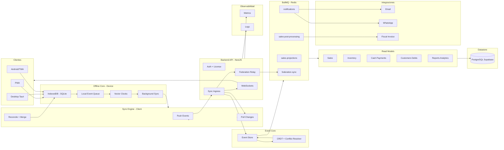
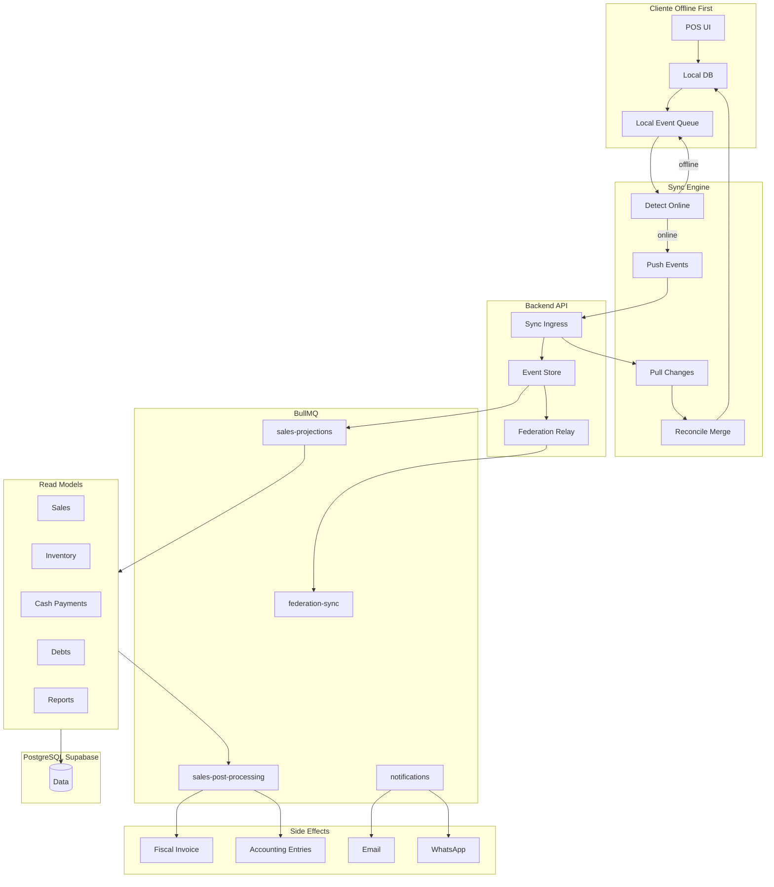
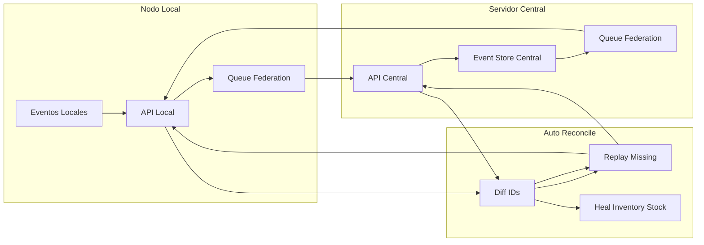
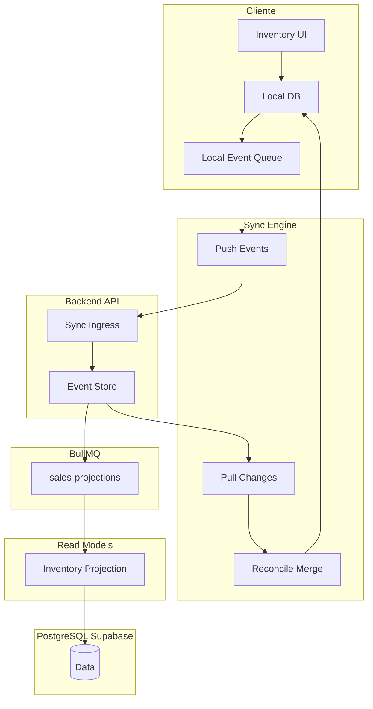
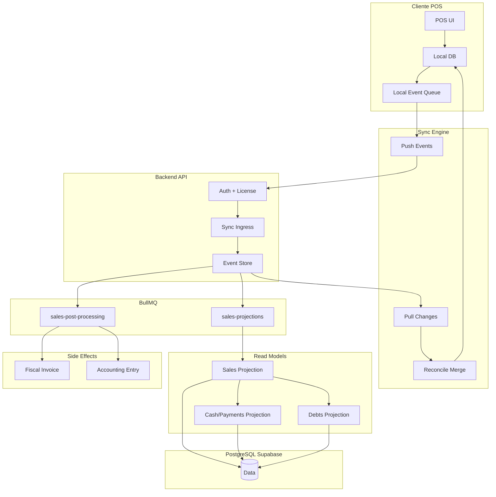
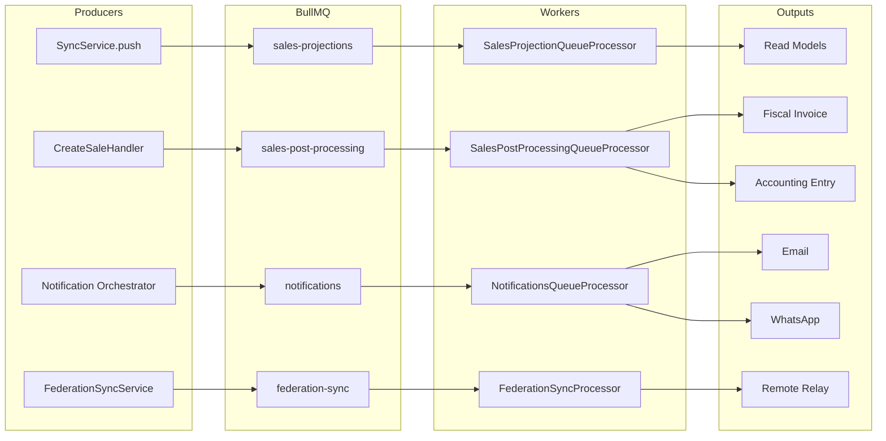

# Velox POS (La Caja)

ERP + POS offline-first con sincronizacion por eventos. Diseñado para vender siempre: sin internet, con reconcilio automatico y proyecciones en background.

## Lo esencial
- **Offline-first real**: ventas, stock y caja funcionan sin red.
- **Sync por eventos**: cola local + vector clocks + reconciliacion.
- **Multicanal**: PWA, Desktop (Tauri) y Android/TWA.
- **Proyecciones asincronas**: BullMQ procesa ventas, inventario y reportes.
- **Federacion**: replica entre servidor central y nodos locales.

## Arquitectura operacional (cerebro Velox POS)



## Subflujos operativos (detalle real)



## Subflujo: federacion y auto-reconcile



## Subflujo: inventario end to end



## Subflujo: ventas offline end to end



## Subflujo: colas BullMQ y proyecciones



## Componentes principales
- **API**: `apps/api` (NestJS + Fastify)
- **PWA**: `apps/pwa` (React + Vite + Dexie)
- **Desktop**: `apps/desktop` (Tauri + React + SQLite)
- **Shared**: `packages/domain`, `packages/sync`, `packages/offline-core`, `packages/api-client`, `packages/ui-core`, `packages/app-core`

## Flujo operativo (resumen)
1. El cliente crea eventos locales (ventas, stock, caja).
2. Se encolan y sincronizan cuando hay conectividad.
3. El API ingiere eventos y los guarda en el Event Store.
4. BullMQ proyecta a read models y genera reportes/side-effects.
5. La federacion replica entre nodos (local <-> central).

## Estructura del repo
```
LA-CAJA/
├── apps/
│   ├── api/          # Backend NestJS
│   ├── pwa/          # PWA offline-first
│   └── desktop/      # Desktop Tauri
├── packages/
│   ├── domain/       # Dominio y eventos
│   ├── sync/         # Motor de sync
│   ├── offline-core/ # Queue + storage + vector clocks
│   ├── api-client/   # Cliente HTTP tipado
│   ├── ui-core/      # UI shared
│   └── app-core/     # Stores y hooks base
├── docs/
├── scripts/
└── .github/workflows/
```

## Desarrollo
```bash
npm install
npm run dev:api
npm run dev:pwa
npm run dev:desktop
```

## Documentacion
- Indice: `docs/README.md`
- Mapa de sistema: `docs/architecture/VELOX_SYSTEM_MAP.md`
- Arquitectura offline: `docs/architecture/ARQUITECTURA_OFFLINE_ROBUSTA.md`
- Roadmap: `docs/roadmap/roadmap la caja.md`
