# Velox POS (La Caja)

ERP + POS offline-first con sincronizacion por eventos. Diseñado para vender siempre: sin internet, con reconcilio automatico y proyecciones en background.

## Lo esencial
- **Offline-first real**: ventas, stock y caja funcionan sin red.
- **Sync por eventos**: cola local + vector clocks + reconciliacion.
- **Multicanal**: PWA, Desktop (Tauri) y Android/TWA.
- **Proyecciones asincronas**: BullMQ procesa ventas, inventario y reportes.
- **Federacion**: replica entre servidor central y nodos locales.

## Arquitectura operacional (cerebro Velox POS)

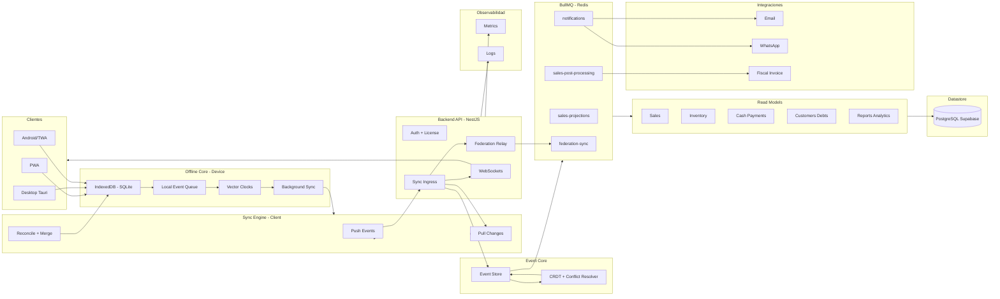

## Subflujos operativos (detalle real)

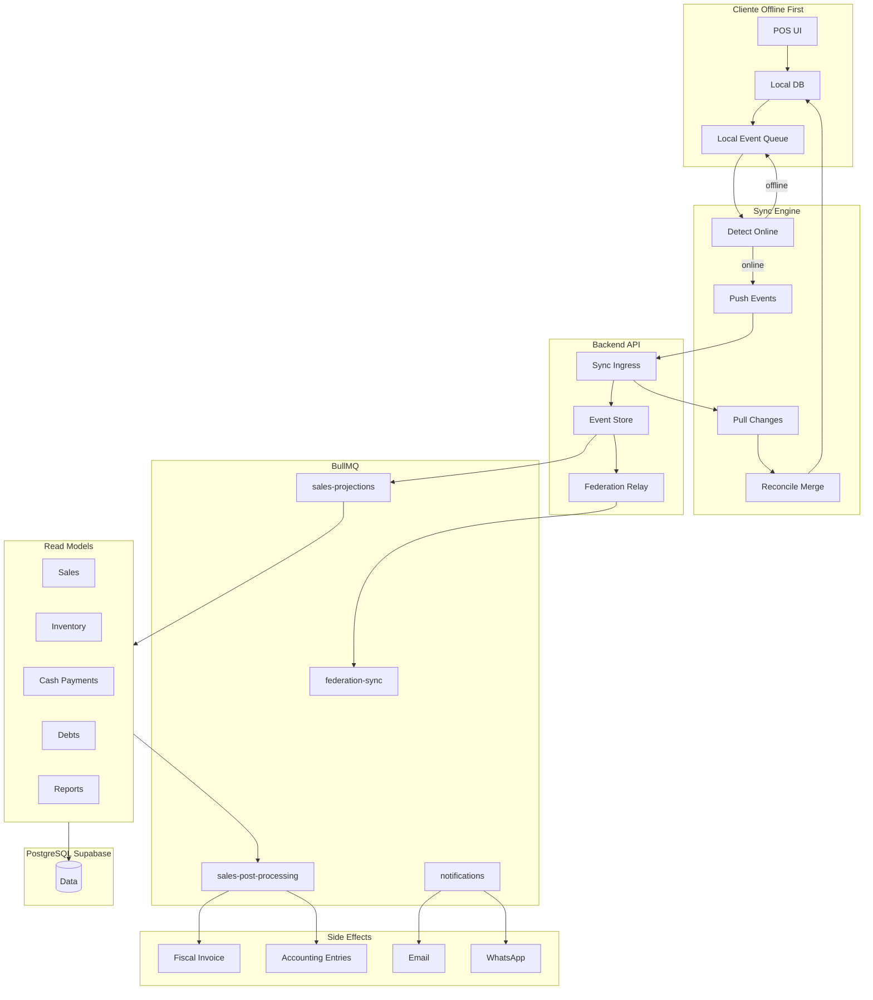

## Subflujo: federacion y auto-reconcile

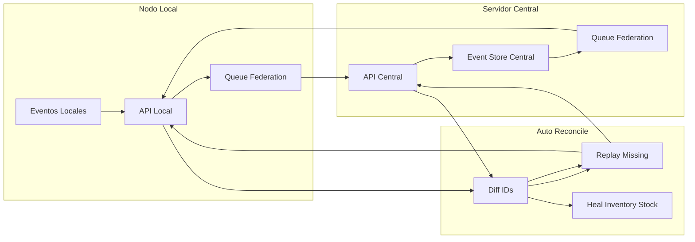

## Subflujo: inventario end to end

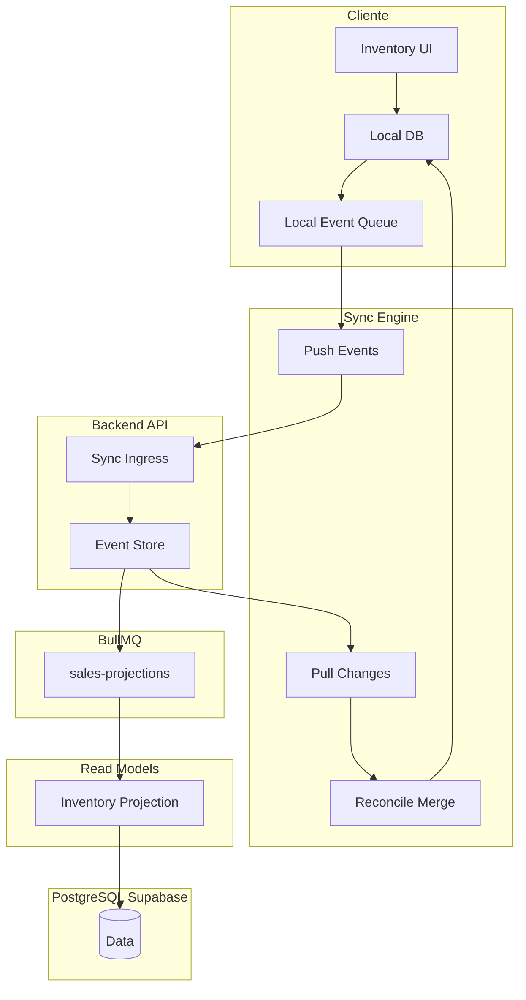

## Subflujo: ventas offline end to end


## Subflujo: colas BullMQ y proyecciones

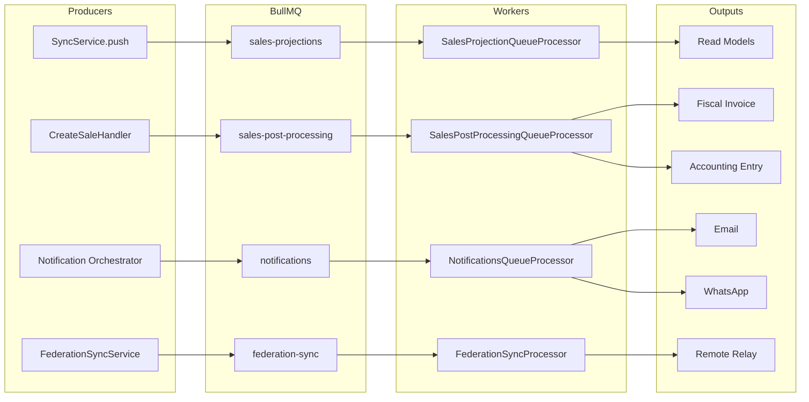

## Subflujo: seguridad y licencias

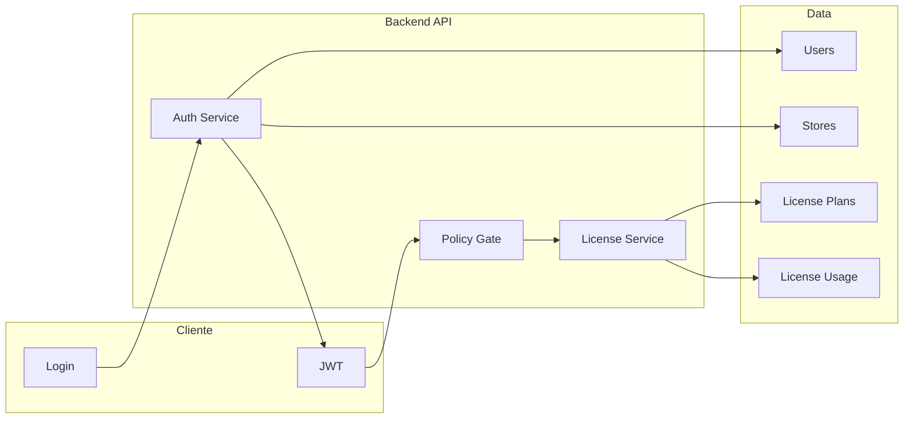

## Subflujo: datos y proyecciones

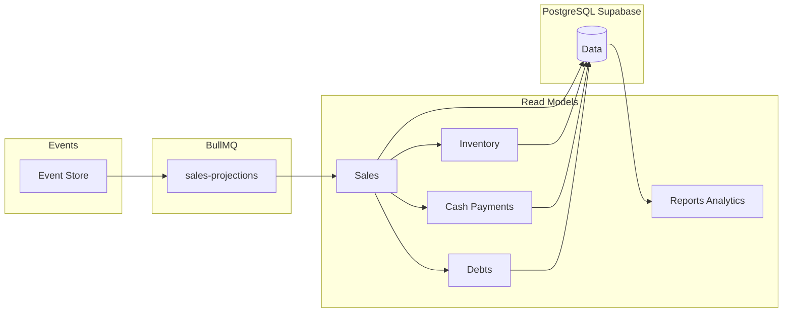

## Leyenda (rapida)
- **Event Store**: fuente de verdad operativa.
- **Queues**: procesamiento asincrono y backpressure.
- **Read Models**: vistas optimizadas para UI y reportes.
- **Federation**: replica y autoreconcile entre nodos.

## Componentes principales
- **API**: `apps/api` (NestJS + Fastify)
- **PWA**: `apps/pwa` (React + Vite + Dexie)
- **Desktop**: `apps/desktop` (Tauri + React + SQLite)
- **Shared**: `packages/domain`, `packages/sync`, `packages/offline-core`, `packages/api-client`, `packages/ui-core`, `packages/app-core`

## Flujo operativo (resumen)
1. El cliente crea eventos locales (ventas, stock, caja).
2. Se encolan y sincronizan cuando hay conectividad.
3. El API ingiere eventos y los guarda en el Event Store.
4. BullMQ proyecta a read models y genera reportes/side-effects.
5. La federacion replica entre nodos (local <-> central).

## Estructura del repo
```
LA-CAJA/
├── apps/
│   ├── api/          # Backend NestJS
│   ├── pwa/          # PWA offline-first
│   └── desktop/      # Desktop Tauri
├── packages/
│   ├── domain/       # Dominio y eventos
│   ├── sync/         # Motor de sync
│   ├── offline-core/ # Queue + storage + vector clocks
│   ├── api-client/   # Cliente HTTP tipado
│   ├── ui-core/      # UI shared
│   └── app-core/     # Stores y hooks base
├── docs/
├── scripts/
└── .github/workflows/
```

## Inmersión Profunda: El Cerebro Velox

Esta sección detalla los mecanismos internos que garantizan la consistencia y disponibilidad del sistema ("The Velox Brain").

### 1. Motor de Sincronización (Sync Engine Internals)

El motor utiliza un sistema de **doble persistencia** (IndexedDB + Memoria) con un mecanismo de "Hard Recovery" para garantizar que ningún evento se pierda.

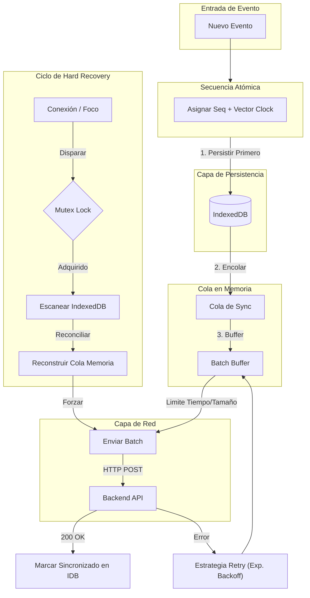

### 2. Resolución de Conflictos (Flujo de Decisión CRDT)

Cuando el servidor recibe eventos concurrentes, decide automáticamente la estrategia de convergencia.

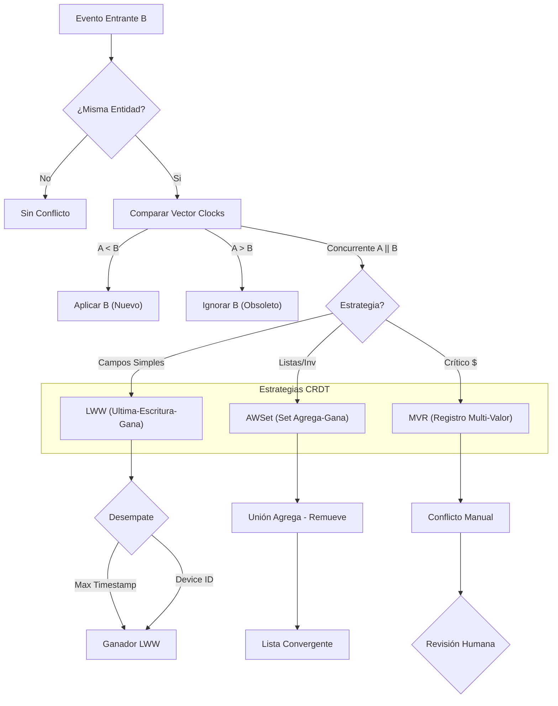

### 3. Consistencia de Cola y Anti-Tormenta (Queue Consistency)

Evita "tormentas" de sincronización y estados inconsistentes ("fantasmas").

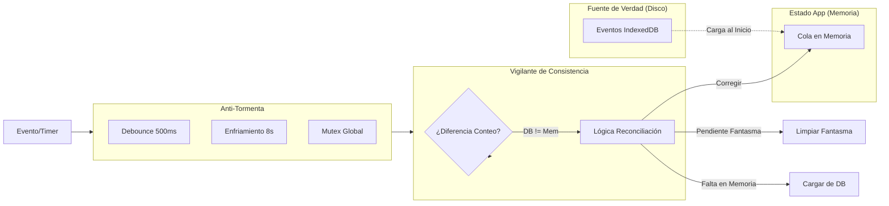

### 4. Federación Multi-Nodo (Smart Auto-Heal)

Sincronización robusta entre nodo local y central, capaz de autoreparar brechas de datos.

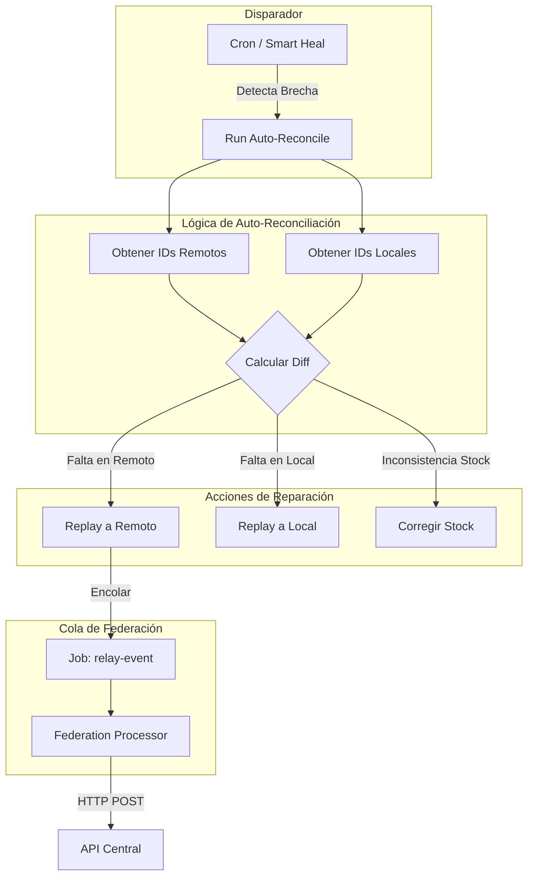

### 5. Procesamiento Asíncrono (Backend Pipeline)

Pipeline de procesamiento de eventos de ventas para mantener la respuesta al cliente por debajo de 50ms.

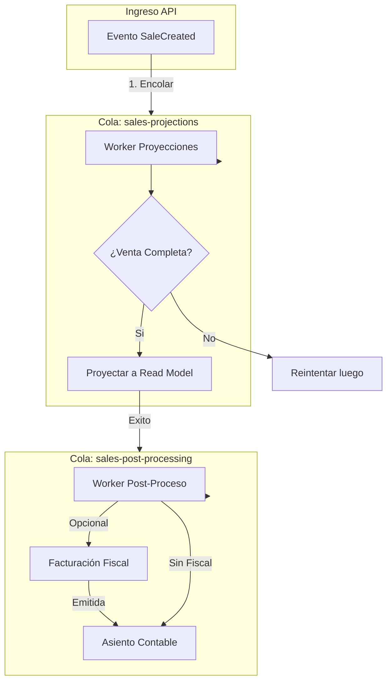

## Desarrollo
```bash
npm ci
npm run dev:api
npm run dev:pwa
npm run dev:desktop
```

**Entorno y CI local:** Requisitos (Node 20, `npm ci`), script `./scripts/check-env.sh` y pasos para verificar builds/tests/lint como en CI: [docs/development/ENTORNO_LOCAL.md](docs/development/ENTORNO_LOCAL.md).

### 6. Integraciones Futuras / Roadmap

Arquitectura planeada para subsistemas en desarrollo activo.

#### 6.1. Capa de Hardware Híbrida (Print & Peripherals)
Modelo de abstracción para manejar impresión nativa (Desktop) y web (PWA).

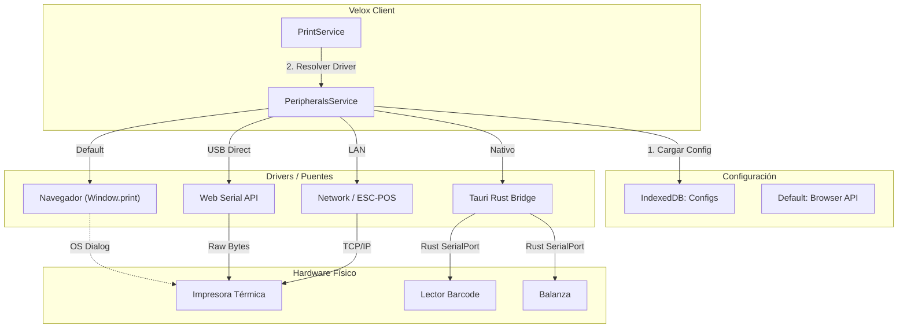

#### 6.2. Autenticación Offline (Credenciales Distribuidas)
Mecanismo de "Replica de Credenciales" para permitir login sin internet.

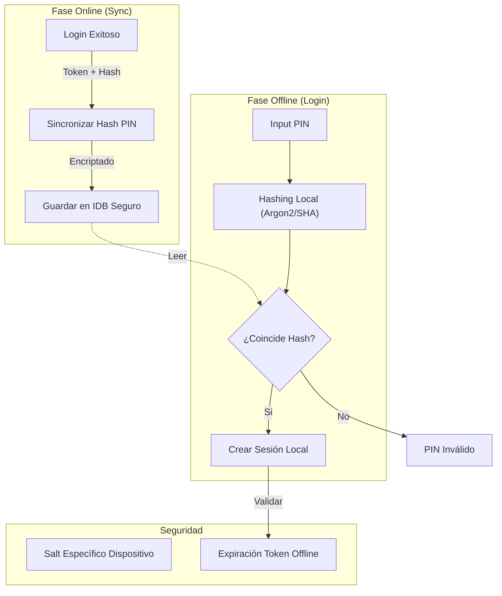


## Documentacion
- Indice: `docs/README.md`
- Mapa de sistema: `docs/architecture/VELOX_SYSTEM_MAP.md`
- Arquitectura offline: `docs/architecture/ARQUITECTURA_OFFLINE_ROBUSTA.md`
- Matriz de trazabilidad (README vs codigo): `docs/architecture/VELOX_TRACEABILITY_MATRIX.md`
- Roadmap: `docs/roadmap/roadmap la caja.md`
