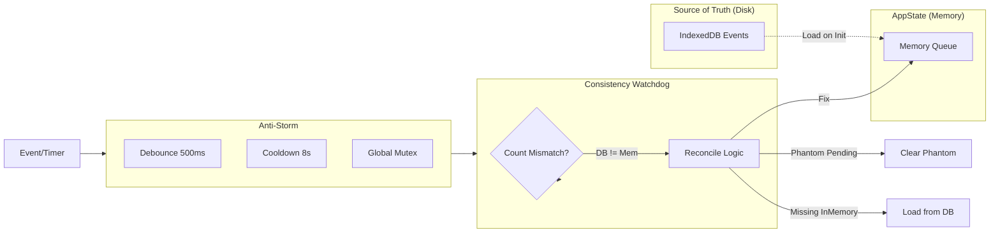

# Velox POS (La Caja)

ERP + POS offline-first con sincronizacion por eventos. Diseñado para vender siempre: sin internet, con reconcilio automatico y proyecciones en background.

## Lo esencial
- **Offline-first real**: ventas, stock y caja funcionan sin red.
- **Sync por eventos**: cola local + vector clocks + reconciliacion.
- **Multicanal**: PWA, Desktop (Tauri) y Android/TWA.
- **Proyecciones asincronas**: BullMQ procesa ventas, inventario y reportes.
- **Federacion**: replica entre servidor central y nodos locales.

## Arquitectura operacional (cerebro Velox POS)


## Subflujos operativos (detalle real)


## Subflujo: federacion y auto-reconcile


## Subflujo: inventario end to end


## Subflujo: ventas offline end to end


## Subflujo: colas BullMQ y proyecciones


## Subflujo: seguridad y licencias


## Subflujo: datos y proyecciones


## Leyenda (rapida)
- **Event Store**: fuente de verdad operativa.
- **Queues**: procesamiento asincrono y backpressure.
- **Read Models**: vistas optimizadas para UI y reportes.
- **Federation**: replica y autoreconcile entre nodos.

## Componentes principales
- **API**: `apps/api` (NestJS + Fastify)
- **PWA**: `apps/pwa` (React + Vite + Dexie)
- **Desktop**: `apps/desktop` (Tauri + React + SQLite)
- **Shared**: `packages/domain`, `packages/sync`, `packages/offline-core`, `packages/api-client`, `packages/ui-core`, `packages/app-core`

## Flujo operativo (resumen)
1. El cliente crea eventos locales (ventas, stock, caja).
2. Se encolan y sincronizan cuando hay conectividad.
3. El API ingiere eventos y los guarda en el Event Store.
4. BullMQ proyecta a read models y genera reportes/side-effects.
5. La federacion replica entre nodos (local <-> central).

## Estructura del repo
```
LA-CAJA/
├── apps/
│   ├── api/          # Backend NestJS
│   ├── pwa/          # PWA offline-first
│   └── desktop/      # Desktop Tauri
├── packages/
│   ├── domain/       # Dominio y eventos
│   ├── sync/         # Motor de sync
│   ├── offline-core/ # Queue + storage + vector clocks
│   ├── api-client/   # Cliente HTTP tipado
│   ├── ui-core/      # UI shared
│   └── app-core/     # Stores y hooks base
├── docs/
├── scripts/
└── .github/workflows/
```

## Inmersión Profunda: El Cerebro Velox

Esta sección detalla los mecanismos internos que garantizan la consistencia y disponibilidad del sistema ("The Velox Brain").

### 1. Motor de Sincronización (Sync Engine Internals)

El motor utiliza un sistema de **doble persistencia** (IndexedDB + Memoria) con un mecanismo de "Hard Recovery" para garantizar que ningún evento se pierda, incluso si la aplicación se cierra inesperadamente o el navegador decide eliminar la memoria de la pestaña.

```mermaid
flowchart TD
    subgraph Input["Input Event"]
        NewEvent[New Event]
    end

    subgraph Atomic["Atomic Sequence"]
        Seq[Allocate Seq + Vector Clock]
    end

    subgraph Persistence["Persistence Layer"]
        IDB[(IndexedDB)]
    end

    subgraph Memory["Memory Queue"]
        Queue[Sync Queue]
        Batch[Batch Buffer]
    end

    subgraph Network["Network Layer"]
        Flush[Flush Batch]
        API[Backend API]
    end

    subgraph Recovery["Hard Recovery Loop"]
        Online[Connectivity / Focus] -->|Trigger| Lock{Mutex Lock}
        Lock -->|Acquired| Scan[Scan IndexedDB]
        Scan -->|Reconcile| Rebuild[Rebuild Memory Queue]
        Rebuild -->|Force| Flush
    end

    NewEvent --> Atomic
    Atomic -->|1. Persist First| IDB
    IDB -->|2. Enqueue| Queue
    Queue -->|3. Buffer| Batch
    Batch -->|Time/Size Limit| Flush
    Flush -->|HTTP POST| API

    API -->|200 OK| Ack[Mark Synced in IDB]
    API -->|Error| Retry[Retry Strategy (Exp. Backoff)]
    Retry --> Batch
```

### 2. Resolución de Conflictos (CRDTs Decision Flow)

Cuando el servidor recibe eventos concurrentes (detectados vía Vector Clocks), el `ConflictResolutionService` decide automáticamente la estrategia de convergencia basada en el tipo de dato.

```mermaid
flowchart TD
    Start[Evento Entrante B] --> Detect{¿Misma Entidad?}
    Detect -->|No| NoConflict[Sin Conflicto]
    Detect -->|Si| VC[Comparar Vector Clocks]

    VC -->|A < B| Apply[Aplicar B (Nuevo)]
    VC -->|A > B| Ignore[Ignorar B (Obsoleto)]
    VC -->|Concurrent A || B| Strategy{Estrategia?}

    subgraph Strategies["Estrategias CRDT"]
        LWW[LWW (Last-Write-Wins)]
        AWSet[AWSet (Add-Wins Set)]
        MVR[MVR (Multi-Value Register)]
    end

    Strategy -->|Simple Fields| LWW
    Strategy -->|Lists/Inv| AWSet
    Strategy -->|Critical $| MVR

    LWW --> TieBr{Tie Breaker}
    TieBr -->|Max Timestamp| WinnerLWW[Ganador LWW]
    TieBr -->|Device ID| WinnerLWW

    AWSet --> Union[Union Adds - Removes]
    Union --> ResultAW[Lista Convergente]

    MVR --> Manual[Conflicto Manual]
     Manual --> Human{Revisión Humana}
```

### 3. Queue Consistency & Anti-Storm

Para evitar "tormentas" de sincronización y estados inconsistentes ("fantasmas"), el sistema implementa un monitor de consistencia que reconcilia la verdad del disco con la memoria.



## Desarrollo
```bash
npm install
npm run dev:api
npm run dev:pwa
npm run dev:desktop
```

## Documentacion
- Indice: `docs/README.md`
- Mapa de sistema: `docs/architecture/VELOX_SYSTEM_MAP.md`
- Arquitectura offline: `docs/architecture/ARQUITECTURA_OFFLINE_ROBUSTA.md`
- Roadmap: `docs/roadmap/roadmap la caja.md`
