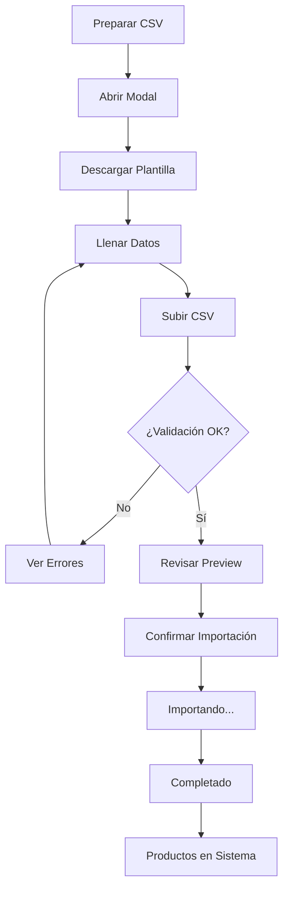

# 📥 Importación de Productos desde CSV

Esta guía explica cómo importar múltiples productos a la vez usando archivos CSV.

## 🚀 Cómo Usar

### 1. Acceder a la Función

1. Ve a **Gestión de Productos**
2. Haz clic en el botón **"Importar CSV"** (ícono de subida)

### 2. Preparar tu Archivo CSV

#### Formato del Archivo

El archivo CSV debe tener la siguiente estructura:

```csv
nombre,categoria,sku,codigo_barras,precio_bs,precio_usd,costo_bs,costo_usd,stock_minimo
Producto 1,Electrónica,SKU001,123456789,100.00,25.00,80.00,20.00,10
Producto 2,Ropa,SKU002,987654321,50.00,12.50,40.00,10.00,5
Producto 3,Alimentos,SKU003,111222333,30.00,7.50,25.00,6.25,20
```

#### Columnas Requeridas ✅

Estas columnas DEBEN estar presentes:

- **nombre**: Nombre del producto (texto)
- **precio_bs**: Precio en Bolívares (número decimal)
- **precio_usd**: Precio en Dólares (número decimal)

#### Columnas Opcionales ⭕

Estas columnas son opcionales pero recomendadas:

- **categoria**: Categoría del producto
- **sku**: Código SKU
- **codigo_barras**: Código de barras
- **costo_bs**: Costo en Bolívares (por defecto: 0)
- **costo_usd**: Costo en Dólares (por defecto: 0)
- **stock_minimo**: Umbral mínimo de stock (por defecto: 10)

### 3. Descargar Plantilla

El modal tiene un botón **"Descargar Plantilla"** que te da un archivo CSV de ejemplo con todas las columnas correctamente formateadas.

### 4. Proceso de Importación

#### Paso 1: Seleccionar Archivo
- Haz clic en el área de carga o arrastra tu archivo CSV
- El sistema validará automáticamente el archivo

#### Paso 2: Revisar Preview
- Verás una tabla con todos los productos a importar
- Revisa que los datos sean correctos
- Verás errores de validación si los hay

#### Paso 3: Confirmar Importación
- Haz clic en "Importar X Productos"
- Verás una barra de progreso durante la importación
- Recibirás una notificación cuando termine

## ⚠️ Validaciones

El sistema valida automáticamente:

✅ **Nombre**: No puede estar vacío
✅ **Precio Bs**: Debe ser mayor a 0
✅ **Precio USD**: Debe ser mayor a 0
✅ **Formato CSV**: Debe ser un archivo .csv válido
✅ **Columnas**: Deben estar las columnas requeridas

## 💡 Consejos

### Formato de Números
- Usa **punto** (.) como separador decimal: `100.50` ✅
- NO uses coma (,) como separador decimal: `100,50` ❌
- NO uses separadores de miles: `1,000.00` ❌

### Excel a CSV
Si estás creando el archivo en Excel:

1. Crea tu tabla en Excel
2. Ve a **Archivo > Guardar Como**
3. Selecciona **CSV (separado por comas) (.csv)**
4. Guarda el archivo

### Google Sheets a CSV
Si estás usando Google Sheets:

1. Ve a **Archivo > Descargar**
2. Selecciona **Valores separados por comas (.csv)**

### Caracteres Especiales
- Puedes usar acentos y ñ: "Niño", "Electrónica" ✅
- Evita caracteres especiales en números: solo dígitos y punto

## 🔍 Ejemplos

### Ejemplo Básico (Solo Requeridos)
```csv
nombre,precio_bs,precio_usd
Coca Cola 2L,15.00,3.75
Pepsi 2L,14.00,3.50
```

### Ejemplo Completo (Todas las Columnas)
```csv
nombre,categoria,sku,codigo_barras,precio_bs,precio_usd,costo_bs,costo_usd,stock_minimo
Laptop Dell,Electrónica,DELL001,7501234567890,12000.00,3000.00,10000.00,2500.00,5
Mouse Logitech,Accesorios,LOG001,7501234567891,150.00,37.50,120.00,30.00,20
Teclado Mecánico,Accesorios,KEY001,7501234567892,400.00,100.00,320.00,80.00,15
```

### Ejemplo con Valores Vacíos
```csv
nombre,categoria,sku,codigo_barras,precio_bs,precio_usd,costo_bs,costo_usd,stock_minimo
Producto Sin SKU,,,,50.00,12.50,40.00,10.00,10
Producto Básico,,,7501234567893,30.00,7.50,,,
```

## 🐛 Solución de Problemas

### Error: "Faltan columnas requeridas"
**Causa**: El CSV no tiene las columnas obligatorias
**Solución**: Asegúrate de que la primera línea tenga: `nombre,precio_bs,precio_usd`

### Error: "El precio debe ser mayor a 0"
**Causa**: Algún producto tiene precio 0 o negativo
**Solución**: Verifica que todos los precios sean números positivos

### Error: "El nombre es requerido"
**Causa**: Hay una fila con el nombre vacío
**Solución**: Completa el nombre en todas las filas o elimina filas vacías

### Error: "Por favor selecciona un archivo CSV"
**Causa**: El archivo no tiene extensión .csv
**Solución**: Guarda el archivo con extensión .csv

## 📊 Limitaciones

- **Tamaño máximo**: No hay límite técnico, pero archivos muy grandes (>1000 productos) pueden tardar varios minutos
- **Formato**: Solo archivos .csv (no .xlsx, .xls, etc.)
- **Separador**: Debe usar coma (,) como separador
- **Codificación**: UTF-8 (para acentos y caracteres especiales)

## 🎯 Mejores Prácticas

1. **Prueba primero** con 2-3 productos antes de importar todo
2. **Descarga la plantilla** y úsala como base
3. **Valida en Excel/Sheets** antes de importar
4. **Haz backup** de tus productos actuales antes de importaciones masivas
5. **Revisa el preview** antes de confirmar la importación

## 🔄 Proceso Completo



## 📝 Notas

- Los productos se crean como **activos** por defecto
- Si un SKU o código de barras ya existe, se creará un producto duplicado (no se actualiza)
- La importación NO afecta el inventario (stock), solo crea productos
- Después de importar, puedes ajustar stock manualmente o importar inventario

## 🆘 Soporte

Si tienes problemas con la importación:

1. Verifica que el CSV siga el formato exacto
2. Descarga y usa la plantilla proporcionada
3. Revisa los mensajes de error en el modal
4. Consulta los ejemplos de este documento
