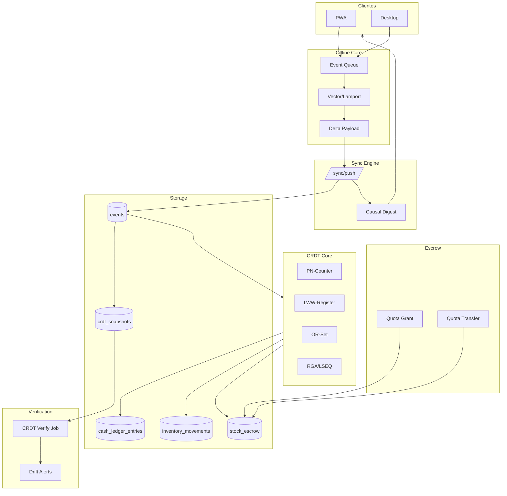

# DIAGRAMA CRDT MAX (Alto Nivel)

```mermaid
flowchart TB
  subgraph Clients[Clientes]
    PWA[PWA]
    Desktop[Desktop]
  end

  subgraph OfflineCore[Offline Core]
    Queue[Event Queue]
    VC[Vector/Lamport]
    Delta[Delta Payload]
  end

  subgraph Sync[Sync Engine]
    Push[/sync/push/]
    Digest[Causal Digest]
  end

  subgraph CRDTCore[CRDT Core]
    PN[PN-Counter]
    LWW[LWW-Register]
    ORS[OR-Set]
    RGA[RGA/LSEQ]
  end

  subgraph Escrow[Escrow]
    Grant[Quota Grant]
    Transfer[Quota Transfer]
  end

  subgraph Storage[Storage]
    Events[(events)]
    Ledger[(cash_ledger_entries)]
    Movements[(inventory_movements)]
    EscrowTbl[(stock_escrow)]
    Snapshots[(crdt_snapshots)]
  end

  subgraph Verification[Verification]
    Verify[CRDT Verify Job]
    Drift[Drift Alerts]
  end

  PWA --> Queue
  Desktop --> Queue
  Queue --> VC
  VC --> Delta
  Delta --> Push

  Push --> Events
  Push --> Digest

  Events --> CRDTCore
  CRDTCore --> Ledger
  CRDTCore --> Movements
  CRDTCore --> EscrowTbl

  Grant --> EscrowTbl
  Transfer --> EscrowTbl

  Events --> Snapshots
  Snapshots --> Verify
  Verify --> Drift

  Digest --> Clients
```
