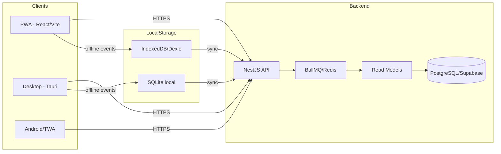
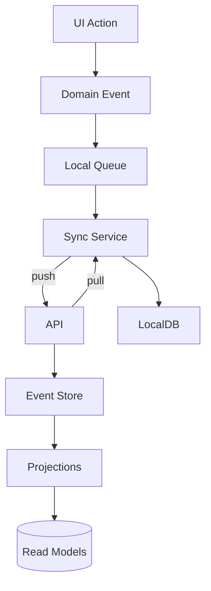

# Velox POS - System Map (End-to-End)

Este documento es el mapa general del sistema para que cualquier agente o ingeniero se contextualice rapido.

## TL;DR
Velox POS es un ERP/POS offline-first con sincronizacion por eventos. Tiene tres clientes principales (PWA, Desktop y Android), un backend NestJS con colas y proyecciones, y un motor de sync que reconcilia bases locales con Supabase/servidor central.

## Canales (Clientes)
- **PWA** (web offline-first): `apps/pwa`
- **Desktop** (Tauri + sidecars): `apps/desktop` + `apps/desktop/src-tauri`
- **Android/TWA** (builds y gradle en repo raiz): `app/`, `build.gradle`, `gradle/`

## Backend
- **API principal** (NestJS + Fastify): `apps/api`
- **DB**: PostgreSQL (Supabase o dedicado) via TypeORM `apps/api/src/database`
- **Colas**: BullMQ/Redis `apps/api/src/queues`
- **Sync y Federacion**: `apps/api/src/sync`

## Paquetes compartidos
- **Dominio/eventos**: `packages/domain`
- **Offline core (queue, storage, vector clock)**: `packages/offline-core`
- **Sync engine**: `packages/sync`
- **API client**: `packages/api-client`
- **UI core**: `packages/ui-core`
- **App core**: `packages/app-core`

## Mapa general (alto nivel)



## Flujo offline-first (eventos -> sync -> reconcile)



## Arbol funcional (dominios clave)

- **Auth/Seguridad/Licencias**
  - API: `apps/api/src/auth`, `apps/api/src/security`, `apps/api/src/licenses`
  - UI: `apps/pwa/src/pages/LoginPage.tsx`, `apps/desktop/src/pages/LoginPage.tsx`
- **Ventas / POS**
  - API: `apps/api/src/sales`
  - UI: `apps/pwa/src/pages/POSPage.tsx`, `apps/desktop/src/pages/POSPage.tsx`
- **Inventario / Productos / Almacenes**
  - API: `apps/api/src/inventory`, `apps/api/src/products`, `apps/api/src/warehouses`
  - UI: `apps/pwa/src/pages/InventoryPage.tsx`, `apps/desktop/src/pages/InventoryPage.tsx`
- **Caja / Pagos**
  - API: `apps/api/src/cash`, `apps/api/src/payments`
  - UI: `apps/pwa/src/pages/CashPage.tsx`, `apps/pwa/src/pages/PaymentsPage.tsx`
- **Clientes / Deudas**
  - API: `apps/api/src/customers`, `apps/api/src/debts`
  - UI: `apps/pwa/src/pages/CustomersPage.tsx`, `apps/pwa/src/pages/DebtsPage.tsx`
- **Compras / Proveedores**
  - API: `apps/api/src/purchase-orders`, `apps/api/src/suppliers`
  - UI: `apps/pwa/src/pages/PurchaseOrdersPage.tsx`, `apps/pwa/src/pages/SuppliersPage.tsx`
- **Fiscal / Facturas / Series**
  - API: `apps/api/src/fiscal-configs`, `apps/api/src/fiscal-invoices`, `apps/api/src/invoice-series`
  - UI: `apps/pwa/src/pages/FiscalInvoicesPage.tsx`, `apps/pwa/src/pages/FiscalConfigPage.tsx`
- **Pedidos / Mesas / Reservas**
  - API: `apps/api/src/orders`, `apps/api/src/tables`, `apps/api/src/reservations`
  - UI: `apps/pwa/src/pages/TablesPage.tsx`, `apps/pwa/src/pages/ReservationsPage.tsx`
- **Reportes / Analitica / ML**
  - API: `apps/api/src/reports`, `apps/api/src/realtime-analytics`, `apps/api/src/ml`
  - UI: `apps/pwa/src/pages/ReportsPage.tsx`, `apps/pwa/src/pages/RealtimeAnalyticsPage.tsx`
- **Sync / Offline / Federacion**
  - API: `apps/api/src/sync`, `apps/api/src/queues`, `apps/api/src/projections`
  - Shared: `packages/sync`, `packages/offline-core`, `packages/domain`

## Entrypoints que todo agente debe conocer
- **API**: `apps/api/src/main.ts`, `apps/api/src/app.module.ts`
- **PWA**: `apps/pwa/src/main.tsx`, `apps/pwa/src/App.tsx`, `apps/pwa/src/sw.ts`
- **Desktop**: `apps/desktop/src/main.tsx`, `apps/desktop/src/App.tsx`, `apps/desktop/src-tauri/src/main.rs`

## Repo map (resumen operativo)

```
LA-CAJA/
├── apps/
│   ├── api/          # Backend NestJS
│   ├── pwa/          # PWA offline-first
│   └── desktop/      # Tauri Desktop
├── packages/
│   ├── domain/       # Eventos y reglas de negocio
│   ├── sync/         # Motor de sync
│   ├── offline-core/ # Queue + storage + vector clocks
│   ├── api-client/   # Cliente HTTP tipado
│   ├── ui-core/      # UI shared
│   └── app-core/     # Stores y hooks base
├── docs/             # Arquitectura, offline, roadmap, deployment
├── scripts/          # Scripts operativos
├── docker-compose.yml
└── .github/workflows # CI/CD
```

## Notas de operacion
- **Colas y reintentos**: `apps/api/src/queues`, `packages/sync`
- **Cache**: `apps/api/src/common/cache`
- **Realtime**: `apps/api/src/realtime-analytics`, `apps/api/src/notifications`

---

Si necesitas un diagrama mas detallado (por ejemplo: eventos por dominio o mapa de colas BullMQ), lo agrego como anexo en este mismo archivo.
