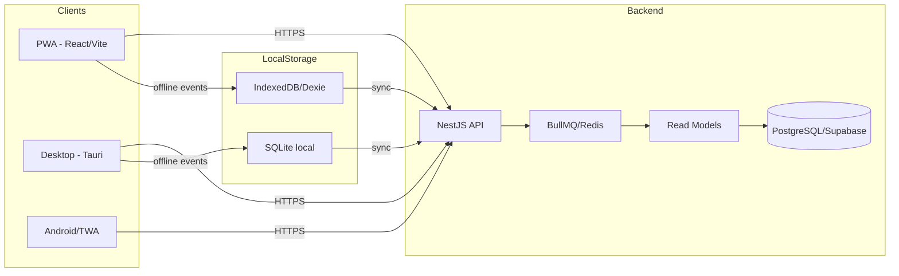
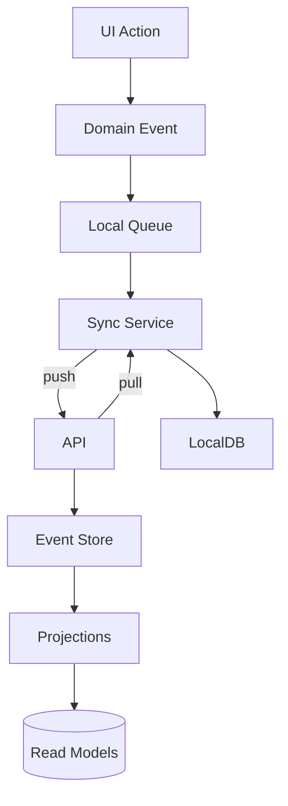
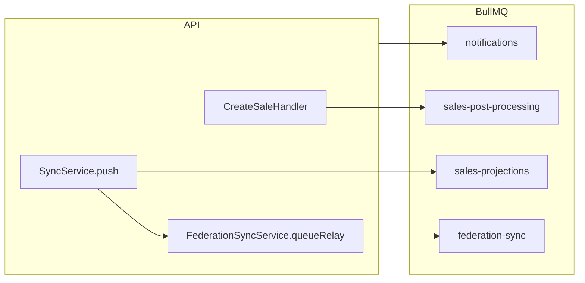

# Velox POS - System Map (End-to-End)

Este documento es el mapa general del sistema para que cualquier agente o ingeniero se contextualice rapido.

## TL;DR
Velox POS es un ERP/POS offline-first con sincronizacion por eventos. Tiene tres clientes principales (PWA, Desktop y Android), un backend NestJS con colas y proyecciones, y un motor de sync que reconcilia bases locales con Supabase/servidor central.

## Canales (Clientes)
- **PWA** (web offline-first): `apps/pwa`
- **Desktop** (Tauri + sidecars): `apps/desktop` + `apps/desktop/src-tauri`
- **Android/TWA** (builds y gradle en repo raiz): `app/`, `build.gradle`, `gradle/`

## Backend
- **API principal** (NestJS + Fastify): `apps/api`
- **DB**: PostgreSQL (Supabase o dedicado) via TypeORM `apps/api/src/database`
- **Colas**: BullMQ/Redis `apps/api/src/queues`
- **Sync y Federacion**: `apps/api/src/sync`

## Paquetes compartidos
- **Dominio/eventos**: `packages/domain`
- **Offline core (queue, storage, vector clock)**: `packages/offline-core`
- **Sync engine**: `packages/sync`
- **API client**: `packages/api-client`
- **UI core**: `packages/ui-core`
- **App core**: `packages/app-core`

## Mapa general (alto nivel)



## Flujo offline-first (eventos -> sync -> reconcile)



## Arbol funcional (dominios clave)

- **Auth/Seguridad/Licencias**
  - API: `apps/api/src/auth`, `apps/api/src/security`, `apps/api/src/licenses`
  - UI: `apps/pwa/src/pages/LoginPage.tsx`, `apps/desktop/src/pages/LoginPage.tsx`
- **Ventas / POS**
  - API: `apps/api/src/sales`
  - UI: `apps/pwa/src/pages/POSPage.tsx`, `apps/desktop/src/pages/POSPage.tsx`
- **Inventario / Productos / Almacenes**
  - API: `apps/api/src/inventory`, `apps/api/src/products`, `apps/api/src/warehouses`
  - UI: `apps/pwa/src/pages/InventoryPage.tsx`, `apps/desktop/src/pages/InventoryPage.tsx`
- **Caja / Pagos**
  - API: `apps/api/src/cash`, `apps/api/src/payments`
  - UI: `apps/pwa/src/pages/CashPage.tsx`, `apps/pwa/src/pages/PaymentsPage.tsx`
- **Clientes / Deudas**
  - API: `apps/api/src/customers`, `apps/api/src/debts`
  - UI: `apps/pwa/src/pages/CustomersPage.tsx`, `apps/pwa/src/pages/DebtsPage.tsx`
- **Compras / Proveedores**
  - API: `apps/api/src/purchase-orders`, `apps/api/src/suppliers`
  - UI: `apps/pwa/src/pages/PurchaseOrdersPage.tsx`, `apps/pwa/src/pages/SuppliersPage.tsx`
- **Fiscal / Facturas / Series**
  - API: `apps/api/src/fiscal-configs`, `apps/api/src/fiscal-invoices`, `apps/api/src/invoice-series`
  - UI: `apps/pwa/src/pages/FiscalInvoicesPage.tsx`, `apps/pwa/src/pages/FiscalConfigPage.tsx`
- **Pedidos / Mesas / Reservas**
  - API: `apps/api/src/orders`, `apps/api/src/tables`, `apps/api/src/reservations`
  - UI: `apps/pwa/src/pages/TablesPage.tsx`, `apps/pwa/src/pages/ReservationsPage.tsx`
- **Reportes / Analitica / ML**
  - API: `apps/api/src/reports`, `apps/api/src/realtime-analytics`, `apps/api/src/ml`
  - UI: `apps/pwa/src/pages/ReportsPage.tsx`, `apps/pwa/src/pages/RealtimeAnalyticsPage.tsx`
- **Sync / Offline / Federacion**
  - API: `apps/api/src/sync`, `apps/api/src/queues`, `apps/api/src/projections`
  - Shared: `packages/sync`, `packages/offline-core`, `packages/domain`

## Entrypoints que todo agente debe conocer
- **API**: `apps/api/src/main.ts`, `apps/api/src/app.module.ts`
- **PWA**: `apps/pwa/src/main.tsx`, `apps/pwa/src/App.tsx`, `apps/pwa/src/sw.ts`
- **Desktop**: `apps/desktop/src/main.tsx`, `apps/desktop/src/App.tsx`, `apps/desktop/src-tauri/src/main.rs`

## Repo map (resumen operativo)

```
LA-CAJA/
├── apps/
│   ├── api/          # Backend NestJS
│   ├── pwa/          # PWA offline-first
│   └── desktop/      # Tauri Desktop
├── packages/
│   ├── domain/       # Eventos y reglas de negocio
│   ├── sync/         # Motor de sync
│   ├── offline-core/ # Queue + storage + vector clocks
│   ├── api-client/   # Cliente HTTP tipado
│   ├── ui-core/      # UI shared
│   └── app-core/     # Stores y hooks base
├── docs/             # Arquitectura, offline, roadmap, deployment
├── scripts/          # Scripts operativos
├── docker-compose.yml
└── .github/workflows # CI/CD
```

## Notas de operacion
- **Colas y reintentos**: `apps/api/src/queues`, `packages/sync`
- **Cache**: `apps/api/src/common/cache`
- **Realtime**: `apps/api/src/realtime-analytics`, `apps/api/src/notifications`

## Mapa de colas BullMQ y eventos (backend)

### Colas BullMQ activas

| Queue | Job(s) | Processor | Producer / Trigger |
| --- | --- | --- | --- |
| `notifications` | `process-ml-insights`, `send-email`, `process-email-queue`, `daily-digest`, `weekly-owner-report` | `apps/api/src/notifications/queues/notifications.queue.ts` | Jobs programados y orquestador de notificaciones en `apps/api/src/notifications` |
| `sales-post-processing` | `post-process-sale` | `apps/api/src/sales/queues/sales-post-processing.queue.ts` | Encolado desde `CreateSaleHandler` `apps/api/src/sales/application/commands/create-sale/create-sale.handler.ts` |
| `sales-projections` | `project-sale-event` (bulk/individual) | `apps/api/src/sales/queues/sales-projection.queue.ts` | Encolado desde `SyncService.push` `apps/api/src/sync/sync.service.ts` |
| `federation-sync` | `relay-event` | `apps/api/src/sync/federation-sync.service.ts` | Encolado por `FederationSyncService.queueRelay` (llamado desde `SyncService.push`) |

### Diagrama rapido de colas



### Eventos dominantes (offline-first)

Fuente: `apps/api/src/sync/sync.service.ts` (`knownEventTypes`).

- `ProductCreated`
- `ProductUpdated`
- `ProductDeactivated`
- `PriceChanged`
- `RecipeIngredientsUpdated`
- `StockReceived`
- `StockAdjusted`
- `SaleCreated`
- `CashSessionOpened`
- `CashSessionClosed`
- `CustomerCreated`
- `CustomerUpdated`
- `DebtCreated`
- `DebtPaymentRecorded`

## Mapa de endpoints (base routes)

Nota: solo rutas base por controller. Los metodos concretos viven en cada controller.

| Base route | Controller |
| --- | --- |
| `/` | `apps/api/src/app.controller.ts` |
| `/auth` | `apps/api/src/auth/auth.controller.ts` |
| `/backup` | `apps/api/src/backup/backup.controller.ts` |
| `/cash` | `apps/api/src/cash/cash.controller.ts` |
| `/config` | `apps/api/src/config/config.controller.ts` |
| `/customers` | `apps/api/src/customers/customers.controller.ts` |
| `/debts` | `apps/api/src/debts/debts.controller.ts` |
| `/discounts` | `apps/api/src/discounts/discounts.controller.ts` |
| `/exchange` | `apps/api/src/exchange/exchange.controller.ts` |
| `/fast-checkout` | `apps/api/src/fast-checkout/fast-checkout.controller.ts` |
| `/fiscal-configs` | `apps/api/src/fiscal-configs/fiscal-configs.controller.ts` |
| `/fiscal-invoices` | `apps/api/src/fiscal-invoices/fiscal-invoices.controller.ts` |
| `/health` | `apps/api/src/health/health.controller.ts` |
| `/inventory` | `apps/api/src/inventory/inventory.controller.ts` |
| `/invoice-series` | `apps/api/src/invoice-series/invoice-series.controller.ts` |
| `/kitchen` | `apps/api/src/kitchen/kitchen-display.controller.ts` |
| `/licenses` | `apps/api/src/licenses/licenses.controller.ts` |
| `/ml` | `apps/api/src/ml/ml.controller.ts` |
| `/ml-notifications` | `apps/api/src/notifications/ml-notifications.controller.ts` |
| `/notifications` | `apps/api/src/notifications/notifications.controller.ts` |
| `/observability` | `apps/api/src/observability/observability.controller.ts` |
| `/orders` | `apps/api/src/orders/orders.controller.ts` |
| `/payments` | `apps/api/src/payments/payments.controller.ts` |
| `/peripherals` | `apps/api/src/peripherals/peripherals.controller.ts` |
| `/price-lists` | `apps/api/src/price-lists/price-lists.controller.ts` |
| `/product-lots` | `apps/api/src/product-lots/product-lots.controller.ts` |
| `/product-serials` | `apps/api/src/product-serials/product-serials.controller.ts` |
| `/product-variants` | `apps/api/src/product-variants/product-variants.controller.ts` |
| `/products` | `apps/api/src/products/products.controller.ts` |
| `/promotions` | `apps/api/src/promotions/promotions.controller.ts` |
| `/public/kitchen` | `apps/api/src/kitchen/kitchen-public.controller.ts` |
| `/public/menu` | `apps/api/src/menu/menu.controller.ts` |
| `/purchase-orders` | `apps/api/src/purchase-orders/purchase-orders.controller.ts` |
| `/realtime-analytics` | `apps/api/src/realtime-analytics/realtime-analytics.controller.ts` |
| `/recipes` | `apps/api/src/recipes/recipes.controller.ts` |
| `/reports` | `apps/api/src/reports/reports.controller.ts` |
| `/reservations` | `apps/api/src/reservations/reservations.controller.ts` |
| `/sales` | `apps/api/src/sales/sales.controller.ts` |
| `/security/audit` | `apps/api/src/security/security-audit.controller.ts` |
| `/setup` | `apps/api/src/setup/setup.controller.ts` |
| `/shifts` | `apps/api/src/shifts/shifts.controller.ts` |
| `/supplier-price-lists` | `apps/api/src/supplier-price-lists/supplier-price-lists.controller.ts` |
| `/suppliers` | `apps/api/src/suppliers/suppliers.controller.ts` |
| `/sync` | `apps/api/src/sync/sync.controller.ts` |
| `/tables` | `apps/api/src/tables/tables.controller.ts` |
| `/transfers` | `apps/api/src/transfers/transfers.controller.ts` |
| `/warehouses` | `apps/api/src/warehouses/warehouses.controller.ts` |
| `/whatsapp` | `apps/api/src/whatsapp/whatsapp.controller.ts` |
| `/admin` | `apps/api/src/admin/admin.controller.ts` |
| `/admin/license-payments` | `apps/api/src/licenses/admin-license-payments.controller.ts` |
| `/dashboard` | `apps/api/src/dashboard/dashboard.controller.ts` |
