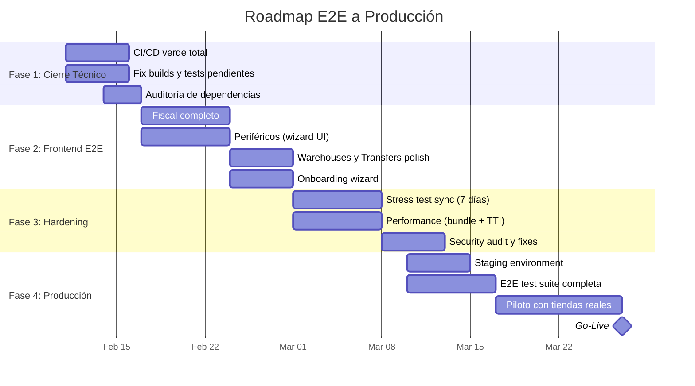

# 🚀 Roadmap End-to-End a Producción — Velox POS (LA-CAJA)

**Fecha:** 2026-02-10  
**Objetivo:** Documento único y ejecutable para llevar Velox POS desde su estado actual (Beta Avanzada) hasta un producto **100% listo para producción comercial**.

> [!IMPORTANT]
> Este roadmap agrupa TODO lo pendiente en fases secuenciales con tareas concretas, verificables y priorizadas por impacto al negocio. Reemplaza y consolida la información dispersa en múltiples archivos del directorio `docs/roadmap/`.

---

## 📊 Estado Actual (Línea Base)

| Capa | Estado | Detalle |
|------|--------|---------|
| **Backend API (NestJS)** | ✅ 95% | 55 módulos, 100+ entidades, 80+ endpoints. Contabilidad, fiscal, CQRS en ventas, CRDT sync, ML — todo construido. |
| **Frontend PWA (React)** | ✅ 85% | 49 páginas implementadas. POS, Inventario, Ventas, Clientes, Reportes, Contabilidad, Turnos — operativo. |
| **Desktop (Tauri)** | ✅ 80% | Mirror del PWA con sidecar Tailscale. Build funcional en CI. |
| **Packages compartidos** | ✅ 90% | `ui-core`, `app-core`, `api-client`, `offline-core`, `crdt`, `domain`, `sync` — consolidados. |
| **Sync / Offline-first** | ✅ 85% | CRDT MAX implementado, Vector Clocks, SHA-256 hashing, Web Locks. Falta stress testing prolongado. |
| **CI/CD** | 🟡 70% | GitHub Actions con build+test+lint para 3 apps. Falta validación de Desktop tests y pipeline de release. |
| **Infraestructura** | 🟡 75% | Netlify (PWA) + Render (API) + Docker local (Postgres+Redis). Falta staging environment formal. |
| **Testing** | 🟡 60% | Tests unitarios en API (34+ specs passing). E2E con Playwright configurado. Falta cobertura sistémica. |
| **Seguridad** | 🟡 65% | JWT, Helmet, CORS, throttling. Falta auditoría de dependencias y ASVS L2 cerrado. |

---

## 🗺️ Fases del Roadmap



---

## Fase 1: Cierre Técnico (1 semana)

> **Meta:** 100% builds verdes, 0 vulnerabilidades HIGH, CI confiable.

### 1.1 CI/CD Pipeline Completo

- [ ] Verificar que `ci.yml` pasa en push a `main`/`develop` (actualmente tiene jobs para API, PWA, Desktop)
- [ ] Agregar step de `npm audit --audit-level=high` al CI
- [ ] Agregar step de E2E smoke test (Playwright, flujo POS mínimo)
- [ ] Configurar caching de `node_modules` y artifacts para acelerar pipeline
- [ ] Crear workflow de release para Desktop (`release-desktop.yml` ya existe — validar)

### 1.2 Builds y Tests Verdes

- [ ] Verificar `npm run build` completo (packages + api + pwa + desktop)
- [ ] Verificar `npm run test --workspaces --if-present` sin fallos
- [ ] Resolver warnings de lint pendientes (`lint:ratchet` baseline)
- [ ] Asegurar que tests de Desktop ejecutan (`npm run test:run --workspace=apps/desktop`)

### 1.3 Auditoría de Dependencias

- [ ] Ejecutar `npm audit` y resolver todas las vulnerabilidades HIGH
- [ ] Documentar vulnerabilidades moderate aceptadas con justificación
- [ ] Actualizar dependencias con vulnerabilidades conocidas
- [ ] Verificar que no hay secretos expuestos en el repo (`.env` files en `.gitignore`)

---

## Fase 2: Frontend End-to-End (2 semanas)

> **Meta:** Todas las funcionalidades del backend con UI completa y pulida.

### 2.1 Módulo Fiscal Completo

**Estado actual:** `FiscalConfigPage.tsx` (12KB), `FiscalInvoicesPage.tsx` (21KB), `FiscalInvoiceDetailPage.tsx` (19KB) existen. Faltan flujos de emisión y configuración avanzada.

- [ ] Completar `FiscalConfigPage`: formulario de datos fiscales (RIF, dirección, autorización SENIAT)
- [ ] Agregar acción "Emitir" en `FiscalInvoicesPage` que llame a `/fiscal-invoices/:id/issue`
- [ ] Agregar botón "Crear Factura Fiscal" desde historial de ventas (`SalesPage`)
- [ ] Validar impresión de factura fiscal con datos reales (`FiscalInvoicePrintView.tsx`)
- [ ] Agregar indicador de estado de factura (draft / issued / cancelled) con colores

### 2.2 Integración de Periféricos (Setup Wizard)

**Estado actual:** `PeripheralsPage.tsx` es un esqueleto (764 bytes). Backend soporta scanner, printer, drawer, scale, customer_display.

- [ ] Crear `PeripheralSetupWizard.tsx`: asistente paso a paso para configurar impresora, balanza, scanner
- [ ] Implementar detección de puertos (Web Serial API) con lista de dispositivos disponibles
- [ ] Crear `PrinterTestButton.tsx`: botón para imprimir ticket de prueba
- [ ] Crear `ScaleTestWidget.tsx`: widget para leer peso en tiempo real
- [ ] Agregar estado de conexión de periféricos en el header/sidebar del POS

### 2.3 Multi-bodega y Transferencias

**Estado actual:** `WarehousesPage.tsx` (24KB) y `TransfersPage.tsx` (27KB) ya existen con funcionalidad avanzada. `WarehouseFormModal.tsx` (30KB) está completo.

- [ ] Verificar CRUD completo de bodegas funciona E2E con datos reales
- [ ] Verificar flujo de transferencia: crear → enviar → recibir → confirmar
- [ ] Agregar validación de stock disponible en bodega origen antes de enviar
- [ ] Agregar filtro por bodega en `InventoryPage`

### 2.4 Onboarding / First-Run Wizard

**Estado actual:** `OnboardingPage.tsx` es un esqueleto (987 bytes).

- [ ] Implementar wizard de primera ejecución:
  1. Datos de la tienda (nombre, dirección, RIF)
  2. Configuración fiscal básica
  3. Método de pago por defecto (efectivo)
  4. Primer producto de prueba
  5. Configuración de impresora (opcional)
- [ ] Redirigir automáticamente si la tienda no tiene datos básicos configurados
- [ ] Agregar botón "Saltar" para usuarios avanzados

### 2.5 Páginas Esqueleto Pendientes

- [ ] `PeripheralsPage.tsx` → completar con lista de periféricos configurados + wizard
- [ ] `OnboardingPage.tsx` → implementar wizard (2.4)
- [ ] `AnomaliesPage.tsx` (748 bytes) → conectar con servicio ML de anomalías existente
- [ ] `PaymentsPage.tsx` (3KB) → verificar que gestión de métodos de pago funciona E2E

---

## Fase 3: Hardening y Performance (2 semanas)

> **Meta:** Sistema robusto bajo carga, rápido, y seguro.

### 3.1 Stress Test de Sincronización

- [ ] Crear script de chaos testing: 3 dispositivos offline → 500+ transacciones → reconexión → verificar convergencia
- [ ] Ejecutar test durante 7 días continuos en entorno local (Ryzen + Docker)
- [ ] Medir y documentar:
  - Tasa de sincronización exitosa (objetivo: >99.5%)
  - Conflictos sin resolver (objetivo: <0.5%)
  - Tiempo de convergencia (objetivo: <30 segundos)
- [ ] Probar escenarios de red intermitente (throttle + desconexión aleatoria)
- [ ] Verificar idempotencia: replay de eventos no duplica datos

### 3.2 Performance Frontend

- [ ] Medir tamaño actual del bundle de producción (`npm run build:pwa` + analizar `dist/`)
- [ ] Objetivo: chunk principal < 900KB minificado
- [ ] Implementar lazy loading en páginas pesadas no-POS:
  - `AccountingPage` (16KB), `ReportsPage` (42KB), `DashboardPage` (50KB)
  - `SalesPage` (50KB), `ProductsPage` (49KB), `CustomersPage` (31KB)
- [ ] Medir TTI con Lighthouse (objetivo: <2.5s en dispositivo medio)
- [ ] Optimizar imágenes y assets estáticos

### 3.3 Performance Backend

- [ ] Identificar queries lentas en dashboard y POS (activar `pg_stat_statements`)
- [ ] Agregar índices faltantes para queries frecuentes
- [ ] Implementar cache Redis para endpoints de dashboard y reportes
- [ ] Verificar que no hay N+1 queries en endpoints de POS

### 3.4 Seguridad Final

- [ ] Checklist ASVS L2 aplicado a módulos: auth, sync, sales, payments
- [ ] Verificar rotación de JWT: access token (15min), refresh token (7d)
- [ ] Verificar que logout invalida sesiones correctamente
- [ ] Auditar logs de acciones sensibles (login, cambio de rol, eliminación de datos)
- [ ] Verificar headers de seguridad en Netlify (ya configurados en `netlify.toml`)
- [ ] Revisar RLS policies en Supabase/Postgres para multi-tenant isolation

---

## Fase 4: Staging, E2E y Go-Live (2-3 semanas)

> **Meta:** Ambiente de staging → suite E2E → piloto real → producción.

### 4.1 Environment de Staging

- [ ] Crear rama `staging` en GitHub
- [ ] Configurar Netlify preview para rama `staging` (ya tiene deploy automático)
- [ ] Crear instancia de Render separada para API staging (o usar branch de Render)
- [ ] Base de datos staging con datos seed representativos (no datos reales de clientes)
- [ ] Documentar variables de entorno necesarias por ambiente

### 4.2 Suite E2E Completa (Playwright)

**Estado actual:** Playwright configurado en `playwright.config.ts`. Framework listo.

- [ ] **Flujo POS completo:** abrir turno → buscar producto → agregar al carrito → checkout → pago efectivo → cerrar turno
- [ ] **Flujo Inventario:** crear producto → ajustar stock → verificar en POS
- [ ] **Flujo Clientes:** crear cliente → asignar a venta → verificar en historial
- [ ] **Flujo Fiscal:** crear venta → generar factura fiscal → verificar datos
- [ ] **Flujo Offline:** desconectar red → hacer venta → reconectar → verificar sincronización
- [ ] **Flujo Auth:** login → navegación → refresh token → logout
- [ ] **Flujo Reportes:** generar reporte de ventas → verificar datos → exportar

### 4.3 Piloto con Tiendas Reales

- [ ] Seleccionar 2-3 tiendas piloto
- [ ] Instalar y configurar Velox POS en tiendas piloto
- [ ] Capacitar operadores (cajeros) — crear video tutorial o guía rápida
- [ ] Monitorear durante 7-10 días con soporte activo
- [ ] Métricas de éxito del piloto:
  - Tasa de éxito de ventas (objetivo: >98%)
  - Tiempo promedio de checkout (objetivo: <15 segundos)
  - Sincronización exitosa diaria (objetivo: 100%)
  - Satisfacción del operador (encuesta simple)
- [ ] Corregir bugs encontrados durante el piloto

### 4.4 Go-Live Checklist

- [ ] Todos los tests de CI verdes
- [ ] Suite E2E pasando al 100%
- [ ] Vulnerabilidades HIGH = 0
- [ ] Piloto completado con métricas satisfactorias
- [ ] Runbook de incidentes documentado (qué hacer si cae la API, si no sincroniza, etc.)
- [ ] Backup automatizado de base de datos (script `scripts/backup-db.sh`)
- [ ] Monitoring/alertas básicas activas (al menos health checks)
- [ ] Documentación de usuario final (guía rápida de operación)

---

## 📋 Resumen de Entregables

| # | Entregable | Fase | Prioridad |
|---|-----------|------|-----------|
| 1 | CI/CD 100% verde con auditoría | Fase 1 | 🔴 Crítica |
| 2 | Builds y tests sin fallos | Fase 1 | 🔴 Crítica |
| 3 | Módulo Fiscal E2E | Fase 2 | 🔴 Crítica |
| 4 | Setup Wizard de Periféricos | Fase 2 | 🟡 Alta |
| 5 | Onboarding Wizard | Fase 2 | 🟡 Alta |
| 6 | Multi-bodega verificado E2E | Fase 2 | 🟡 Alta |
| 7 | Páginas esqueleto completadas | Fase 2 | 🟡 Alta |
| 8 | Stress test sync (7 días) | Fase 3 | 🔴 Crítica |
| 9 | Bundle <900KB + TTI <2.5s | Fase 3 | 🟡 Alta |
| 10 | Seguridad ASVS L2 cerrada | Fase 3 | 🔴 Crítica |
| 11 | Staging environment | Fase 4 | 🔴 Crítica |
| 12 | Suite E2E (7 flujos) | Fase 4 | 🔴 Crítica |
| 13 | Piloto 2-3 tiendas | Fase 4 | 🔴 Crítica |
| 14 | Go-Live | Fase 4 | 🏁 Final |

---

## 🏗️ Arquitectura de Producción

```
                    ┌─────────────────┐
                    │   Usuarios      │
                    │  (Navegador)    │
                    └────────┬────────┘
                             │
                    ┌────────▼────────┐
                    │    Netlify      │
                    │   (PWA/SPA)     │
                    │  React + Vite   │
                    └────────┬────────┘
                             │ HTTPS
               ┌─────────────┼─────────────┐
               │             │             │
      ┌────────▼───┐  ┌─────▼──────┐  ┌───▼────────┐
      │  Render    │  │  Ryzen     │  │  Desktop   │
      │  (API)     │  │  (Local)   │  │  (Tauri)   │
      │  Fallback  │  │  Primary   │  │  + Sidecar │
      └────────┬───┘  └─────┬──────┘  └───┬────────┘
               │             │             │
               │      ┌─────▼──────┐      │
               │      │ Tailscale  │      │
               │      │  Funnel    │◄─────┘
               │      └─────┬──────┘
               │             │
          ┌────▼─────────────▼────┐
          │    PostgreSQL 17      │
          │    + Redis 7          │
          │    (Docker Compose)   │
          └───────────────────────┘
```

---

## ⏱️ Estimación de Tiempo

| Fase | Duración | Acumulado |
|------|----------|-----------|
| Fase 1: Cierre Técnico | 1 semana | Semana 1 |
| Fase 2: Frontend E2E | 2 semanas | Semana 3 |
| Fase 3: Hardening | 2 semanas | Semana 5 |
| Fase 4: Staging + Piloto | 2-3 semanas | Semana 7-8 |
| **Total estimado** | **7-8 semanas** | **~Marzo 27, 2026** |

> [!TIP]
> Las Fases 3 y 4 pueden solaparse: mientras corre el stress test (3.1), se puede configurar staging (4.1) y escribir tests E2E (4.2) en paralelo.

---

## 📌 Referencias

- [Plan Maestro de Sprints](./VELOX_POS_LINEA_A_SPRINTS_2026.md)
- [Zonas No Terminadas](./ZONAS_NO_TERMINADAS_TAREAS.md)
- [Issues Sprint 1 y 7](./ISSUES_PR_SPRINT_1_Y_7.md)
- [Deployment Guide](../deployment/DEPLOY.md)
- [Producción Local](../deployment/PRODUCCION_LOCAL.md)
- [CI Workflow](../../.github/workflows/ci.yml)
